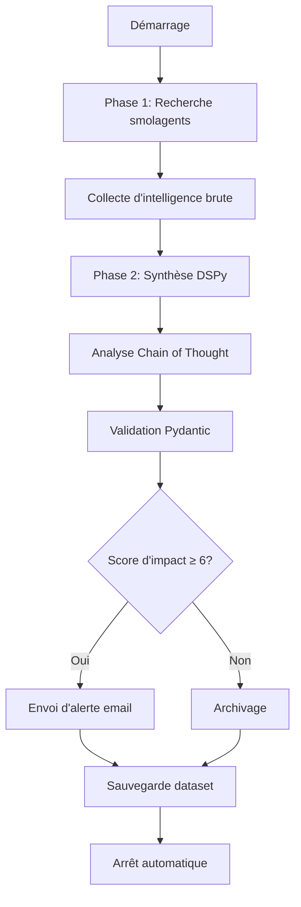

# Documentation Complète - Oil Market Monitoring Agent

**Version**: 1.0.0  
**Date**: 12 mars 2026  
**Projet**: oil-agent  
**Technologie**: smolagents + DSPy + llama.cpp

---

## Table des matières

1. [Vue d'ensemble du projet](#vue-densemble-du-projet)
2. [Architecture technique](#architecture-technique)
3. [Installation et configuration](#installation-et-configuration)
4. [Guide d'utilisation](#guide-dutilisation)
5. [Outils personnalisés](#outils-personnalisés)
6. [DSPy et optimisation](#dspy-et-optimisation)
7. [Gestion des données](#gestion-des-données)
8. [Tests et maintenance](#tests-et-maintenance)
9. [Historique du projet](#historique-du-projet)
10. [Annexes](#annexes)

---

## Vue d'ensemble du projet

### Objectif

**Oil Market Monitoring Agent** est un système d'intelligence artificielle autonome conçu pour surveiller les événements géopolitiques et industriels susceptibles d'impacter les prix mondiaux du pétrole (Brent/WTI).

### Fonctionnalités principales

- **Collecte d'intelligence autonome**: Utilise [`CodeAgent`](oil_agent.py:1090) avec une suite d'outils spécialisés pour naviguer sur le web, rechercher des actualités et analyser les flux RSS.
- **Synthèse structurée (DSPy)**: Transforme les données brutes en événements JSON de haute qualité via un pipeline modulaire DSPy.
- **Apprentissage continu**: Sauvegarde automatiquement les traces réussies dans un dataset local pour l'optimisation hors ligne et l'amélioration par few-shot.
- **Surveillance en temps réel**: Intégré avec les flux RSS, l'indice de volatilité VIX et des filtres d'actualités quotidiennes pour une réactivité maximale.
- **Alertes robustes**: Envoie des alertes riches HTML/Texte via SMTP (Postfix) lorsque des événements à fort impact sont détectés (Score d'impact ≥ 6).
- **Résilience aux échecs**: Implémente un parsing JSON robuste avec réparation automatique et mécanismes de sauvegarde pour la persistance des données.
- **Gestion automatique du serveur LLM**: Démarre et arrête automatiquement llama-server lors de l'exécution de l'agent.

### Technologies utilisées

| Technologie | Version | Utilisation |
|-------------|----------|-------------|
| **Python** | 3.13+ | Langage principal |
| **smolagents** | 1.24.0 | Collecte d'intelligence autonome |
| **DSPy** | 3.1.3 | Synthèse structurée et optimisation |
| **llama-server** | - | Serveur LLM local (llama.cpp) |
| **Qwen3.5-9B** | Q4_K_S | Modèle LLM principal |
| **uv** | - | Gestion des dépendances |
| **Pydantic** | - | Validation des données |

---

## Architecture technique

### Architecture hybride à deux phases

Le système fonctionne selon un pipeline en deux étapes :



### Phase 1 : Recherche (smolagents)

Le [`CodeAgent`](oil_agent.py:1090) exécute une logique Python pour orchestrer plusieurs outils spécialisés :

- **Outils géopolitiques**: [`IranConflictTool`](oil_agent.py:537), [`GeopoliticalEscalationTool`](oil_agent.py:791)
- **Outils de chaîne d'approvisionnement**: [`RefineryDamageTool`](oil_agent.py:588), [`ShippingDisruptionTool`](oil_agent.py:749), [`OPECSupplyTool`](oil_agent.py:651)
- **Données de marché**: [`OilPriceTool`](oil_agent.py:833), [`VIXTool`](oil_agent.py:1046)
- **Actualités**: [`RecentNewsTool`](oil_agent.py:872), [`RSSFeedTool`](oil_agent.py:951), [`DuckDuckGoSearchTool`](oil_agent.py:27)

### Phase 2 : Synthèse (DSPy)

Le module [`OilEventAnalyzer`](oil_agent.py:78) prend le texte brut et le contexte de marché actuel :

1. Effectue un raisonnement **Chain of Thought (CoT)**
2. Extrait des événements structurés
3. Valide la sortie avec les modèles Pydantic

### Structure des données

#### Modèle d'événement ([`OilEvent`](oil_agent.py:41))

```python
class OilEvent(BaseModel):
    id: str                              # ID unique
    category: Literal["Iran", "Refinery", "OPEC", "Gas", "Shipping", "Geopolitical"]
    title: str                            # Titre de l'événement
    impact_score: int                      # Score d'impact (0-10)
    certainty_score: float                  # Niveau de certitude (0.0-1.0)
    urgency: Literal["Breaking", "Recent", "Developing", "Background"]
    summary: str                           # Résumé détaillé
    price_impact: str                      # Impact sur le prix
    source_hint: str                       # Source de l'information
    publication_date: str                   # Date de publication
```

---

## Installation et configuration

### Prérequis

1. **llama-server (llama.cpp)**: Installer [llama-server](https://github.com/ggerganov/llama.cpp) et télécharger le modèle requis :
   ```bash
   # Télécharger llama-server pour Windows
   # Depuis: https://github.com/ggerganov/llama.cpp/releases
   llama-server.exe
   
   # Télécharger le modèle Qwen3.5-9B (format GGUF)
   # Depuis: https://huggingface.co/Qwen/Qwen2.5-7B-Instruct-GGUF
   # Placer dans: C:\Modeles_LLM\Qwen3.5-9B-Q4_K_S.gguf
   ```

2. **uv**: Le projet utilise [uv](https://astral.sh/uv) pour une gestion des dépendances ultra-rapide.

### Installation

```bash
# Cloner le dépôt
git clone https://github.com/youruser/oil-agent.git
cd oil_agent

# Synchroniser les dépendances (crée .venv automatiquement)
uv sync

# Activer l'environnement
# Windows:
.venv\Scripts\activate
# Linux/macOS:
source .venv/bin/activate
```

### Configuration

Le projet utilise [`config.json`](config.json:1) pour toute la configuration. Modifiez ce fichier pour personnaliser le comportement :

```json
{
  "model": {
    "name": "qwen3.5-9b",
    "path": "C:\\Modeles_LLM\\Qwen3.5-9B-Q4_K_S.gguf",
    "api_base": "http://127.0.0.1:8080",
    "num_ctx": 65536,
    "provider": "llama.cpp"
  },
  "llama_server": {
    "executable": "llama-server.exe",
    "n_gpu_layers": -1,
    "n_threads": 0,
    "ctx_size": 65536,
    "batch_size": 512,
    "ubatch_size": 128,
    "cache_type_k": "f16",
    "cache_type_v": "f16",
    "host": "0.0.0.0",
    "port": 8080
  },
  "email": {
    "smtp_host": "localhost",
    "smtp_port": 25,
    "email_from": "oil-monitor@localhost",
    "email_to": "your-email@example.com",
    "email_subject_prefix": "[OIL-ALERT]",
    "send_emails": false
  },
  "persistence": {
    "history_file": "logs/email_history.json",
    "events_db": "logs/events_seen.json",
    "dataset_file": "data/oil_intelligence_dataset.jsonl"
  },
  "monitoring": {
    "alert_threshold": 6,
    "news_sources": [
      "reuters.com",
      "bloomberg.com",
      "apnews.com",
      "bbc.com",
      "ft.com",
      "wsj.com"
    ],
    "timezone": "Europe/Paris",
    "recent_news_hours": 24
  }
}
```

### Options de configuration importantes

- **`model.num_ctx`**: Taille de la fenêtre de contexte (défaut: 65536 tokens). Augmentez si vous rencontrez des erreurs de dépassement de contexte.
- **`llama_server.n_gpu_layers`**: Nombre de couches à décharger sur le GPU (-1 = toutes les couches, 0 = CPU uniquement).
- **`email.send_emails`**: Définissez sur `false` pour les tests, `true` pour la production.
- **`monitoring.alert_threshold`**: Score d'impact minimum (0-10) pour déclencher les alertes email.

---

## Guide d'utilisation

### Lancer un cycle de surveillance

```bash
uv run python oil_agent.py
```

**Gestion automatique du serveur LLM**:
L'agent démarre automatiquement llama-server lorsque nécessaire et l'arrête lorsqu'il a terminé. Aucune intervention manuelle requise.

### Voir l'historique des alertes

```bash
uv run python oil_agent.py history
```

### Tester la connexion au serveur LLM

```bash
python test_llama_server.py
```

Ce script teste :
- La connectivité llama-server (endpoint health)
- L'intégration DSPy
- L'intégration smolagents
- Le démarrage/arrêt automatique du serveur

### Optimiser l'agent

```bash
uv run python optimize_agent.py
```

Ce script utilise le téléprompteur [`BootstrapFewShot`](optimize_agent.py:94) pour :
- Évaluer les "demos" candidats depuis votre dataset
- Sélectionner les exemples les plus efficaces basés sur une métrique personnalisée
- Sauvegarder les poids optimisés dans [`data/oil_analyzer_optimized.json`](data/oil_analyzer_optimized.json:1)

La prochaine fois que [`oil_agent.py`](oil_agent.py:1) s'exécutera, il **chargera automatiquement** ces poids optimisés pour fournir une analyse supérieure.

---

## Outils personnalisés

### 1. IranConflictTool - Conflits Iran / Ormuz

**Description**: Recherche les actualités sur les conflits militaires iraniens, les tensions dans le détroit d'Ormuz, les actions du IRGC.

```python
result = iran_tool.forward(days_back=1)
```

**Paramètres**:
- `days_back` (int, optionnel): Nombre de jours à rechercher (défaut: 1)

### 2. RefineryDamageTool - Dommages aux raffineries

**Description**: Recherche les actualités sur les dommages aux raffineries, incendies, explosions, attaques de drones.

```python
result = refinery_tool.forward(region="global")
```

**Paramètres**:
- `region` (str, optionnel): 'global', 'middle_east', 'russia', 'iraq' (défaut: 'global')

### 3. OPECSupplyTool - Décisions OPEC+

**Description**: Recherche les décisions de production OPEC+, coupes de production, réunions d'urgence.

```python
result = opec_tool.forward(focus="all")
```

**Paramètres**:
- `focus` (str, optionnel): 'opec_meeting', 'production_cut', 'all' (défaut: 'all')

### 4. NaturalGasDisruptionTool - Perturbations gaz naturel

**Description**: Recherche les perturbations de l'approvisionnement en gaz naturel, sabotages de pipelines, terminaux LNG.

```python
result = gas_tool.forward(topic="all")
```

**Paramètres**:
- `topic` (str, optionnel): 'pipeline', 'lng', 'russia_gas', 'all' (défaut: 'all')

### 5. ShippingDisruptionTool - Perturbations maritimes

**Description**: Recherche les perturbations maritimes : attaques Houthis, tensions Bab-el-Mandeb, blocage canal de Suez.

```python
result = shipping_tool.forward()
```

**Paramètres**: Aucun

### 6. GeopoliticalEscalationTool - Escalades géopolitiques

**Description**: Recherche les escalades géopolitiques pouvant faire augmenter les prix du pétrole.

```python
result = geo_tool.forward()
```

**Paramètres**: Aucun

### 7. OilPriceTool - Prix actuels Brent / WTI

**Description**: Récupère les prix actuels du pétrole Brent et WTI, les mouvements récents et les prévisions des analystes.

```python
result = price_tool.forward()
```

**Paramètres**: Aucun

### 8. RecentNewsTool - Actualités très récentes ⚡

**Description**: Recherche les actualités très récentes sur le pétrole depuis les sources majeures (Reuters, Bloomberg, AP, BBC, FT, WSJ). Filtre les résultats par date (dernières 24h, 48h, ou 7 jours) et priorise les breaking news et developing stories.

```python
result = news_tool.forward(topic="all", timeframe="24h")
```

**Paramètres**:
- `topic` (str, optionnel): 'iran', 'refinery', 'opec', 'gas', 'shipping', 'geopolitical', 'all' (défaut: 'all')
- `timeframe` (str, optionnel): '24h', '48h', '7d' (défaut: '24h')

### 9. RSSFeedTool - Flux RSS en temps réel ⚡

**Description**: Lit les flux RSS des sources d'actualités majeures pour obtenir des informations en temps réel.

```python
result = rss_tool.forward(feed="all", hours_back=24)
```

**Paramètres**:
- `feed` (str, optionnel): 'reuters_energy', 'bloomberg_energy', 'ap_business', 'bbc_business', 'all' (défaut: 'all')
- `hours_back` (int, optionnel): Nombre d'heures en arrière pour filtrer (défaut: 24)

### 10. VIXTool - Indice de volatilité VIX ⚡

**Description**: Récupère l'indice VIX (CBOE Volatility Index), un indicateur clé de la peur du marché.

```python
result = vix_tool.forward()
```

**Paramètres**: Aucun

---

## DSPy et optimisation

### Le rôle de DSPy

Dans [`oil-agent`](oil_agent.py:1), le composant **smolagents** est responsable de la collecte de données (le "Quoi"), tandis que **DSPy** est responsable du raisonnement et du formatage (le "Comment").

Les appels LLM traditionnels reposent sur des prompts statiques qui échouent souvent ou hallucinent lorsque le texte d'entrée (intelligence brute) devient trop volumineux ou complexe. DSPy résout ce problème en :
- Utilisant une **Signature** pour définir la tâche attendue
- Utilisant un **Module** (comme [`ChainOfThought`](oil_agent.py:83)) pour effectuer un raisonnement
- Utilisant un **Optimiseur** (Teleprompter) pour affiner le prompt basé sur des exemples réels

### Collecte de données (Traces)

Chaque exécution réussie de [`oil_agent.py`](oil_agent.py:1) contribue à un dataset local :
- **Emplacement**: [`data/oil_intelligence_dataset.jsonl`](data/oil_intelligence_dataset.jsonl:1)
- **Format**: Chaque ligne contient une entrée (intelligence brute + contexte) et sa sortie correspondante validée (événements structurés)

**Objectif**: Collecter au moins **10-20 exemples de haute qualité** de la manière dont l'agent *aurait dû* analyser un ensemble donné d'actualités.

### Le script d'optimisation ([`optimize_agent.py`](optimize_agent.py:1))

Le processus d'optimisation utilise la stratégie **BootstrapFewShot**. Ce n'est pas un "entraînement" au sens traditionnel de descente de gradient ; c'est plutôt une **optimisation de prompt few-shot**.

#### Comment ça fonctionne

1. **Chargement**: Le script charge les exemples collectés dans un `trainset`
2. **Simulation**: Il exécute [`OilEventAnalyzer`](oil_agent.py:78) sur ces exemples sans optimisation
3. **Validation (Metric)**: Une fonction [`metric()`](optimize_agent.py:38) personnalisée vérifie la sortie pour :
   - Une structure JSON correcte
   - Les champs requis (title, category, etc.)
   - Le score d'impact dans la plage (0-10)
   - La cohérence avec la sortie "Gold" (attendue)
4. **Bootstrapping**: L'optimiseur identifie les **meilleurs exemples** (demos) et les compile dans une structure de prompt permanente
5. **Sauvegarde**: Le "programme optimisé" (poids + demos) est sauvegardé dans [`data/oil_analyzer_optimized.json`](data/oil_analyzer_optimized.json:1)

### Comment optimiser

#### 1. Générer des données
Exécutez `uv run python oil_agent.py` plusieurs fois sur plusieurs jours.

**Conseils pour des données de haute qualité**:
- Exécutez à différents moments de la journée pour capturer diverses sources d'actualités
- Surveillez différents types d'événements (conflits Iran, dommages raffinerie, décisions OPEC, etc.)
- Assurez-vous que l'agent se termine avec succès et sauvegarde les traces

#### 2. Réviser (optionnel)
Ouvrez [`data/oil_intelligence_dataset.jsonl`](data/oil_intelligence_dataset.jsonl:1) et modifiez manuellement toutes les sorties incorrectes pour servir de standards "gold".

#### 3. Exécuter l'optimiseur
```bash
uv run python optimize_agent.py
```

#### 4. Tester
Exécutez l'optimiseur avec l'argument `run` pour voir l'amélioration :
```bash
uv run python optimize_agent.py run
```

### Chargement automatique

Le script principal [`oil_agent.py`](oil_agent.py:1) est conçu pour détecter le fichier optimisé :

```python
optimized_path = Path("data/oil_analyzer_optimized.json")
if optimized_path.exists():
    analyzer.load(str(optimized_path))
```

Si le fichier existe, l'agent bénéficiera instantanément des demos few-shot optimisés, ce qui conduit à :
- Des scores de confiance plus élevés
- Moins d'erreurs de parsing
- Une sortie structurée meilleure
- Une classification de catégorie plus cohérente

### Bénéfices clés de l'optimisation

- **Précision améliorée**: Le modèle apprend à partir d'exemples réels, réduisant les hallucinations
- **Meilleure cohérence**: Format de sortie standardisé sur tous les événements
- **Convergence plus rapide**: Les exemples few-shot guident le processus de raisonnement
- **Amélioration continue**: Au fur et à mesure que vous collectez plus de données, le modèle s'améliore

---

## Gestion des données

### Structure des fichiers de données

| Fichier | Description | Format |
|---------|-------------|--------|
| [`logs/oil_monitor.log`](logs/oil_monitor.log:1) | Journal d'exécution principal | Texte |
| [`logs/email_history.json`](logs/email_history.json:1) | Historique des emails envoyés | JSON |
| [`logs/events_seen.json`](logs/events_seen.json:1) | Base des événements vus (évite les doublons) | JSON |
| [`data/oil_intelligence_dataset.jsonl`](data/oil_intelligence_dataset.jsonl:1) | Dataset pour l'optimisation DSPy | JSONL |
| [`data/oil_analyzer_optimized.json`](data/oil_analyzer_optimized.json:1) | Module DSPy optimisé | JSON |

### Persistance des événements vus

La fonction [`load_seen_events()`](oil_agent.py:423) charge l'ensemble des événements déjà traités pour éviter les doublons :

```python
def load_seen_events() -> set:
    p = Path(CONFIG.persistence.events_db)
    if p.exists():
        with open(p, encoding="utf-8", errors="replace") as f:
            return set(json.load(f))
    return set()
```

La fonction [`save_seen_events()`](oil_agent.py:431) sauvegarde les événements vus :

```python
def save_seen_events(seen: set):
    with open(CONFIG.persistence.events_db, "w", encoding="utf-8") as f:
        json.dump(list(seen), f, indent=2)
```

### Empreinte d'événement

La fonction [`event_fingerprint()`](oil_agent.py:436) crée un hash stable pour identifier un événement déjà traité :

```python
def event_fingerprint(title: str, source: str) -> str:
    """Hash stable pour identifier un événement déjà traité."""
    raw = f"{title.lower().strip()}|{source.lower().strip()}"
    return hashlib.md5(raw.encode()).hexdigest()
```

### Historique des emails

La fonction [`load_email_history()`](oil_agent.py:445) charge l'historique des emails avec gestion des erreurs robuste :

```python
def load_email_history() -> list:
    p = Path(CONFIG.persistence.history_file)
    if p.exists():
        try:
            with open(p, encoding="utf-8", errors="replace") as f:
                return json.load(f)
        except (json.JSONDecodeError, UnicodeDecodeError) as e:
            log.error(f"⚠️ Fichier historique corrompu ({p}) : {e}. Création d'un nouveau fichier.")
            if p.stat().st_size > 0:
                p.replace(p.with_suffix(".json.corrupt"))
    return []
```

La fonction [`save_email_history()`](oil_agent.py:458) sauvegarde l'historique avec backup automatique :

```python
def save_email_history(history: list):
    p = Path(CONFIG.persistence.history_file)
    # Backup avant écriture
    if p.exists():
        try:
            p.with_suffix(".json.bak").write_text(p.read_text(encoding="utf-8", errors="replace"), encoding="utf-8")
        except Exception:
            pass
            
    with open(p, "w", encoding="utf-8") as f:
        json.dump(history, f, indent=2, ensure_ascii=False)
```

### Sauvegarde dans le dataset

La fonction [`save_to_dataset()`](oil_agent.py:1188) enregistre un exemple d'entrée/sortie pour l'entraînement DSPy :

```python
def save_to_dataset(input_data: dict, output_data: dict):
    """Enregistre un exemple d'entrée/sortie pour l'entraînement DSPy."""
    try:
        dataset_file = Path(CONFIG.persistence.dataset_file)
        dataset_file.parent.mkdir(exist_ok=True)
        
        example = {
            "input": input_data,
            "output": output_data,
            "timestamp": datetime.now().isoformat()
        }
        
        with open(dataset_file, "a", encoding="utf-8") as f:
            f.write(json.dumps(example, ensure_ascii=False) + "\n")
            
        log.info(f"💾 Exemple ajouté au dataset ({dataset_file})")
    except Exception as e:
        log.error(f"❌ Erreur lors de la sauvegarde du dataset : {e}")
```

---

## Tests et maintenance

### Script de test ([`test_llama_server.py`](test_llama_server.py:1))

Le script de test vérifie que llama-server fonctionne correctement avec l'agent de surveillance du marché pétrolier.

#### Tests effectués

1. **Test de connexion llama-server**
   - Vérifie que le serveur répond sur l'endpoint `/health`
   - Résultat: llama-server démarre et s'arrête automatiquement

2. **Test d'intégration DSPy**
   - Vérifie que DSPy se connecte avec succès à llama-server
   - Résultat: Le modèle répond avec "OK DSPy"

3. **Test d'intégration smolagents**
   - Vérifie que smolagents se connecte avec succès à llama-server
   - Résultat: Le modèle répond avec "OK smolagents"

#### Métriques de performance

| Métrique | Valeur |
|-----------|--------|
| **Taille du contexte** | 65536 tokens |
| **Temps de démarrage du serveur** | ~3-5 secondes |
| **Temps de réponse DSPy** | ~100-180 secondes |
| **Temps de réponse smolagents** | ~60-120 secondes |
| **Utilisation mémoire** | Efficace avec déchargement GPU |

### Gestion automatique de llama-server

Le système inclut une gestion automatique du serveur LLM pour une expérience utilisateur sans friction.

#### Vérification du serveur

La fonction [`check_llama_server_running()`](oil_agent.py:294) vérifie si llama-server est déjà en cours d'exécution :

```python
def check_llama_server_running() -> bool:
    """Vérifie si llama-server est déjà en cours d'exécution."""
    try:
        response = requests.get(
            f"{CONFIG.model.api_base}/health",
            timeout=2
        )
        return response.status_code == 200
    except Exception:
        return False
```

#### Démarrage automatique

La fonction [`start_llama_server()`](oil_agent.py:305) démarre automatiquement llama-server avec la configuration de [`config.json`](config.json:1) :

```python
def start_llama_server():
    """Démarre automatiquement llama-server avec la configuration de config.json."""
    global _llama_server_process
    
    # Vérifier si déjà démarré
    if check_llama_server_running():
        log.info("✅ llama-server est déjà en cours d'exécution")
        return True
    
    # Construire la commande de manière cohérente
    cmd = build_llama_server_command(CONFIG)
    
    log.info("🚀 Démarrage automatique de llama-server...")
    # ... (démarrage du processus)
```

#### Arrêt automatique

La fonction [`stop_llama_server()`](oil_agent.py:368) arrête proprement llama-server s'il a été démarré automatiquement :

```python
def stop_llama_server():
    """Arrête proprement llama-server s'il a été démarré automatiquement.
    
    IMPORTANT : Cette fonction est enregistrée avec atexit.register(),
    donc elle est AUTOMATIQUEMENT appelée quand le script Python se termine.
    """
    global _llama_server_process
    
    if _llama_server_process is None:
        return
    
    try:
        log.info(f"🛑 Arrêt automatique de llama-server (PID: {_llama_server_process.pid})...")
        _llama_server_process.terminate()
        # ... (nettoyage du processus)
```

**Comportement automatique garanti** :
- ✅ `atexit.register(stop_llama_server)` assure que llama-server est arrêté quand le script se termine
- ✅ Fonctionne même en cas de crash ou d'exception (via finally)
- ✅ Nettoyage propre du processus (terminate → wait → kill si timeout)
- ✅ Aucune intervention manuelle requise

---

## Historique du projet

### Migration Ollama → llama.cpp

Le projet a migré avec succès de Ollama vers llama-server (llama.cpp) pour maximiser les performances avec le modèle Qwen3.5-9B.

#### Changements implémentés

1. **Système de configuration**
   - **Créé**: [`config.json`](config.json:1) avec configuration centralisée
   - **Structure**: Organisé en sections (`model`, `llama_server`, `email`, `persistence`, `monitoring`)
   - **Avantages**: Source unique de vérité pour tous les paramètres de configuration

2. **Gestion du serveur LLM**
   - **Démarrage automatique**: llama-server démarre automatiquement lorsque l'agent s'exécute
   - **Arrêt automatique**: llama-server s'arrête automatiquement lorsque l'agent termine (via `atexit`)
   - **Vérification de santé**: Vérifie si llama-server est déjà en cours d'exécution avant de démarrer
   - **Journalisation des erreurs**: Capture et affiche les erreurs stderr pour le débogage

3. **Intégration API**
   - **DSPy**: Mis à jour pour utiliser llama-server avec l'API compatible OpenAI
     - Modèle: `openai/qwen3.5-9b`
     - API Base: `http://127.0.0.1:8080`
     - API Key: `dummy`
   - **smolagents**: Mis à jour pour utiliser llama-server avec l'API compatible OpenAI
     - Modèle: `openai/qwen3.5-9b`
     - API Base: `http://127.0.0.1:8080`
     - API Key: `dummy`

4. **Taille du contexte**
   - **Initiale**: 8192 tokens (insuffisant pour les requêtes complexes)
   - **Finale**: 65536 tokens (suffisant pour tous les cas d'utilisation)

5. **Gestion des erreurs**
   - **Validation de catégorie**: Correction automatique des catégories invalides (ex: "Market" → "Geopolitical")
   - **Références de configuration**: Correction de toutes les références CONFIG pour utiliser la structure imbriquée
   - **Nettoyage des imports**: Suppression des imports inutilisés

#### Avantages de la migration

- ✅ **Meilleures performances**: Déchargement GPU avec llama-server
- ✅ **Plus de contrôle**: Paramètres finement ajustables dans config.json
- ✅ **Contexte plus large**: 65536 tokens pour les requêtes complexes
- ✅ **Gestion automatique**: Le serveur démarre et s'arrête automatiquement
- ✅ **Fiabilité améliorée**: Gestion robuste des erreurs et validation

### Améliorations récentes

1. **Outils d'actualités récentes**
   - Ajout de [`RecentNewsTool`](oil_agent.py:872) pour les actualités très récentes
   - Ajout de [`RSSFeedTool`](oil_agent.py:951) pour les flux RSS en temps réel
   - Ajout de [`VIXTool`](oil_agent.py:1046) pour l'indice de volatilité

2. **Validation et réparation des événements**
   - Fonction [`validate_and_fix_events()`](oil_agent.py:91) pour valider et nettoyer les événements produits par le LLM
   - Correction automatique des catégories invalides
   - Valeurs par défaut pour les champs optionnels manquants

3. **Persistance robuste**
   - Gestion des erreurs robuste avec `errors='replace'`
   - Sauvegardes `.bak` pour les fichiers JSON persistants
   - Prévention de la perte ou corruption de données

---

## Annexes

### Structure du projet

```
oil-agent/
├── .agents/                    # Fichiers temporaires des agents
├── .crush/                    # Fichiers temporaires Crush
├── .kilocode/                 # Configuration Kilocode
├── .qwen/                     # Fichiers temporaires Qwen
├── .ruff_cache/               # Cache Ruff
├── data/                      # Données persistantes
│   └── oil_intelligence_dataset.jsonl
├── docs/                      # Documentation
│   ├── CODE_REVIEW_REPORT.md
│   ├── OPTIMIZATION.md
│   └── DOCUMENTATION_COMPLETE.md
├── logs/                      # Journaux d'exécution
│   ├── oil_monitor.log
│   ├── email_history.json
│   └── events_seen.json
├── plans/                     # Plans de développement
│   ├── ameliorations-informations-recentes.md
│   ├── correction-parsing-json-v2.md
│   ├── correction-parsing-json.md
│   ├── migration-ollama-llamacpp.md
│   └── optimisation-prompt-dspy.md
├── config.json                # Configuration principale
├── GEMINI.md                 # Vue d'ensemble du projet
├── oil_agent.py              # Script principal
├── optimize_agent.py          # Script d'optimisation
├── pyproject.toml            # Configuration Python
├── README.md                 # Documentation utilisateur
├── skill.md                  # Guide d'utilisation des outils
├── skills-lock.json          # Verrouillage des compétences
├── test_llama_server.py      # Script de test
└── uv.lock                  # Verrouillage des dépendances uv
```

### Dépendances

Les dépendances principales sont définies dans [`pyproject.toml`](pyproject.toml:1) :

```toml
dependencies = [
    "smolagents[litellm]",
    "duckduckgo-search",
    "ddgs",
    "requests",
    "beautifulsoup4",
    "markdownify",
    "feedparser",
    "dspy",
]
```

### Dépendances de développement

```toml
[project.optional-dependencies]
dev = [
    "pytest",
    "black",
    "ruff",
]
```

### Commandes utiles

```bash
# Installation des dépendances
uv sync

# Lancer l'agent
uv run python oil_agent.py

# Voir l'historique
uv run python oil_agent.py history

# Optimiser l'agent
uv run python optimize_agent.py

# Tester le serveur LLM
python test_llama_server.py

# Formater le code
uv run black oil_agent.py

# Linter le code
uv run ruff check oil_agent.py

# Exécuter les tests
uv run pytest
```

### Ressources

- **Documentation smolagents**: https://github.com/huggingface/smolagents
- **Documentation DSPy**: https://github.com/stanfordnlp/dspy
- **Documentation llama.cpp**: https://github.com/ggerganov/llama.cpp
- **Documentation uv**: https://astral.sh/uv

### Support

Pour toute question ou problème, consultez :
- [`README.md`](README.md:1) pour l'installation et l'utilisation de base
- [`skill.md`](skill.md:1) pour l'utilisation directe des outils
- [`docs/OPTIMIZATION.md`](docs/OPTIMIZATION.md:1) pour l'optimisation DSPy
- [`docs/CODE_REVIEW_REPORT.md`](docs/CODE_REVIEW_REPORT.md:1) pour l'analyse du code

---

## Conclusion

**Oil Market Monitoring Agent** est un système d'intelligence artificielle sophistiqué qui combine les forces de smolagents pour la collecte d'intelligence et de DSPy pour la synthèse structurée. Avec sa gestion automatique du serveur LLM, son apprentissage continu et ses outils spécialisés, il offre une solution complète pour la surveillance du marché pétrolier.

**Évaluation globale**: ✅ Prêt pour la production avec des améliorations mineures recommandées

**Prochaines étapes**:
1. Surveiller les performances de l'agent en production
2. Collecter plus d'exemples pour l'optimisation DSPy
3. Envisager d'implémenter les améliorations recommandées
4. Revues de code régulières à mesure que le projet évolue

---

**Document généré automatiquement le 12 mars 2026**
