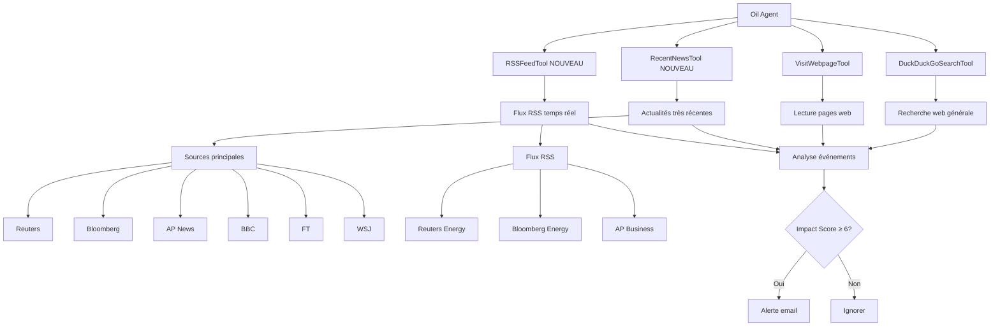

# Plan d'amélioration : Informations très récentes pour Oil Agent

## Objectif
Améliorer l'agent de surveillance du marché pétrolier pour récupérer des informations très récentes (date du jour) et en temps réel.

---

## Analyse actuelle

### Sources actuelles
- **DuckDuckGoSearchTool** : Recherche web générale
- **VisitWebpageTool** : Lecture de pages web
- Requêtes avec année "2025" mais sans filtres de date précis

### Limitations
- Pas de filtrage par date explicite
- Pas de sources d'actualités en temps réel
- Les requêtes peuvent retourner des contenus obsolètes
- Aucune priorisation des résultats récents

---

## Améliorations proposées

### 1. Amélioration des requêtes DuckDuckGo avec filtres de date

**Objectif** : Ajouter des opérateurs de recherche pour cibler les contenus récents

**Modifications** :
- Ajouter des opérateurs de date dans les requêtes :
  - `site:news.com` pour les sites d'actualités
  - `after:YYYY-MM-DD` pour filtrer par date
  - `today`, `yesterday`, `last 24 hours` dans les requêtes

**Exemples** :
```python
# Avant
"Iran military attack oil infrastructure 2025"

# Après
"Iran military attack oil infrastructure after:2025-03-09 site:reuters.com OR site:bloomberg.com OR site:apnews.com"
```

### 2. Création d'un nouveau tool : RecentNewsTool

**Objectif** : Tool dédié à la recherche d'actualités très récentes

**Fonctionnalités** :
- Recherche ciblée sur les sites d'actualités majeurs
- Filtrage par date (24h, 48h, 7 jours)
- Agrégation de plusieurs sources
- Extraction des dates de publication

**Sources à inclure** :
- Reuters (reuters.com)
- Bloomberg (bloomberg.com)
- Associated Press (apnews.com)
- BBC News (bbc.com/news)
- Al Jazeera (aljazeera.com)
- Financial Times (ft.com)
- Wall Street Journal (wsj.com)

**Structure du tool** :
```python
class RecentNewsTool(Tool):
    """Tool : actualités très récentes sur le pétrole"""
    name = "search_recent_news"
    description = (
        "Searches for very recent oil-related news from major news sources. "
        "Filters results by date (last 24h, 48h, or 7 days) and prioritizes "
        "breaking news and developing stories."
    )
    inputs = {
        "topic": {
            "type": "string",
            "description": "Topic to search: 'iran', 'refinery', 'opec', 'gas', 'shipping', 'geopolitical', 'all'",
            "default": "all",
        },
        "timeframe": {
            "type": "string",
            "description": "Time period: '24h', '48h', '7d'. Default: '24h'",
            "default": "24h",
        }
    }
    output_type = "string"
```

### 3. Mise à jour des tools existants

**IranConflictTool** :
- Ajouter filtres de date dans les requêtes
- Inclure des termes temporels : "breaking", "today", "just in"

**RefineryDamageTool** :
- Ajouter sources d'actualités industrielles spécialisées
- Filtrer par date de publication

**OPECSupplyTool** :
- Prioriser les communiqués de presse officiels
- Ajouter sources : opec.org, iea.org

**NaturalGasDisruptionTool** :
- Ajouter sources spécialisées gaz naturel

**ShippingDisruptionTool** :
- Inclure sources maritimes spécialisées

**GeopoliticalEscalationTool** :
- Ajouter sources géopolitiques spécialisées

**OilPriceTool** :
- Ajouter sources de prix en temps réel
- Inclure : investing.com, tradingeconomics.com

### 4. Ajout de nouvelles sources d'actualités

**Google News** :
- Utiliser des requêtes spécifiques pour Google News
- Filtrer par date et région

**Bing News** :
- Alternative à DuckDuckGo pour les actualités
- Meilleur filtrage par date

**RSS Feeds** :
- Ajouter un tool pour lire les flux RSS des sites d'actualités
- Sources :
  - Reuters Energy RSS
  - Bloomberg Energy RSS
  - AP News Business RSS

### 5. Amélioration de la configuration

**Ajouter dans CONFIG** :
```python
CONFIG = {
    # ... configuration existante ...
    
    # Sources d'actualités prioritaires
    "news_sources": [
        "reuters.com",
        "bloomberg.com",
        "apnews.com",
        "bbc.com",
        "ft.com",
        "wsj.com",
    ],
    
    # Fuseau horaire pour les dates
    "timezone": "Europe/Paris",
    
    # Délai maximal pour considérer une actualité comme "récente" (heures)
    "recent_news_hours": 24,
}
```

### 6. Amélioration du prompt principal

**Mise à jour du MASTER_PROMPT** :
- **Ajouter la date du jour dynamiquement** : Utiliser `datetime.now()` pour injecter la date actuelle dans le prompt
- Ajouter des instructions pour prioriser les actualités récentes
- Demander à l'agent de vérifier les dates de publication
- Inclure des critères de fraîcheur dans l'évaluation de l'impact

**Exemple d'implémentation** :
```python
# Injection de la date du jour dans le prompt
from datetime import datetime

current_date = datetime.now().strftime("%Y-%m-%d")
current_datetime = datetime.now().strftime("%Y-%m-%d %H:%M:%S")

MASTER_PROMPT = f"""
You are an expert oil market analyst monitoring geopolitical and industrial events
that could cause oil prices (Brent crude, WTI) to spike or rebound.

CURRENT DATE: {current_date}
CURRENT DATETIME: {current_datetime}

Your mission for this analysis run:

1. Use ALL available specialized tools to gather current intelligence:
   - search_iran_conflict: Iran military tensions, IRGC, Strait of Hormuz
   - search_refinery_damage: Refinery attacks, fires, explosions globally
   - search_opec_supply: OPEC+ cuts, production quota decisions
   - search_gas_disruption: Natural gas pipeline/LNG disruptions
   - search_shipping_disruption: Houthi attacks, tanker seizures, maritime blockages
   - search_geopolitical_escalation: Russia/Ukraine, Libya, Venezuela, Nigeria, etc.
   - get_oil_price: Current Brent/WTI prices and context
   - search_recent_news: Very recent news from major sources (NEW)

2. IMPORTANT: Focus on events from TODAY ({current_date}) and the last 24-48 hours.
   When searching, use date-specific queries like "today", "breaking", "just in",
   and include the current date in search terms.

3. For each event or news item found, evaluate:
   - CATEGORY: (Iran/Refinery/OPEC/Gas/Shipping/Geopolitical/Other)
   - IMPACT SCORE: 1-10 (10 = immediate major oil price spike likely)
   - URGENCY: (Breaking/Recent/Developing/Background)
   - SUMMARY: 2-3 sentences explaining the event and price impact mechanism
   - SOURCE_TITLE: Brief title of the news
   - PUBLICATION_DATE: Date of the news (if available)

4. Filter to keep ONLY events with Impact Score >= {threshold}

5. Return your final answer as a JSON list with this structure:
[
  {{
    "id": "unique_slug",
    "category": "Iran|Refinery|OPEC|Gas|Shipping|Geopolitical",
    "title": "Short event title",
    "impact_score": 8,
    "urgency": "Breaking",
    "summary": "Detailed analysis of the event...",
    "price_impact": "+$3-5/barrel expected",
    "source_hint": "Brief source description",
    "publication_date": "2025-03-10"
  }}
]

If no high-impact events found, return: []

Be thorough, analytical, and focus on ACTIONABLE intelligence for oil traders.
Remember: Current date is {current_date} - prioritize news from today and recent hours.
""".format(threshold=CONFIG["alert_threshold"])
```

---

## Diagramme d'architecture



---

## Implémentation

### Étapes

1. **Créer le nouveau tool RecentNewsTool**
   - Implémenter la recherche avec filtres de date
   - Ajouter les sources d'actualités prioritaires
   - Extraire et afficher les dates de publication

2. **Créer le nouveau tool RSSFeedTool**
   - Implémenter la lecture des flux RSS
   - Parser les entrées XML/Atom
   - Filtrer par date de publication

3. **Mettre à jour les tools existants**
   - Ajouter des filtres de date dans les requêtes
   - Inclure des sources spécialisées
   - Améliorer les descriptions des tools

4. **Mettre à jour la configuration**
   - Ajouter les nouvelles options de configuration
   - Documenter les paramètres

5. **Mettre à jour le prompt principal**
   - Ajouter des instructions pour la fraîcheur des informations
   - Inclure des critères de priorisation

6. **Mettre à jour les dépendances**
   - Ajouter `feedparser` pour les flux RSS
   - Vérifier les dépendances existantes

7. **Tester les améliorations**
   - Tester chaque tool individuellement
   - Tester l'agent complet
   - Vérifier la fraîcheur des résultats

---

## Avantages attendus

1. **Informations plus récentes** : Les alertes seront basées sur des actualités des dernières 24h
2. **Meilleure précision** : Filtrage par date pour éviter les contenus obsolètes
3. **Sources plus fiables** : Priorisation des sources d'actualités majeures
4. **Réactivité accrue** : Détection plus rapide des événements impactants
5. **Meilleure couverture** : Ajout de flux RSS pour une surveillance en temps réel

---

## Risques et limitations

1. **Limitations de l'API DuckDuckGo** : Les filtres de date peuvent ne pas être toujours respectés
2. **Paywalls** : Certaines sources (FT, WSJ) peuvent avoir des paywalls
3. **Rate limiting** : Trop de requêtes peuvent être bloquées
4. **Qualité des flux RSS** : Certains flux peuvent être mal formatés ou obsolètes

---

## Alternatives

Si les améliorations DuckDuckGo ne sont pas suffisantes :

1. **API Google News** : Nécessite une clé API Google Cloud
2. **API Bing News** : Nécessite une clé API Microsoft Azure
3. **NewsAPI.org** : Service d'agrégation d'actualités (gratuit pour usage limité)
4. **GDELT** : Base de données d'événements mondiaux en temps réel (gratuit)

---

## Prochaines étapes

1. Valider le plan avec l'utilisateur
2. Passer en mode Code pour l'implémentation
3. Tester les améliorations
4. Documenter les changements
