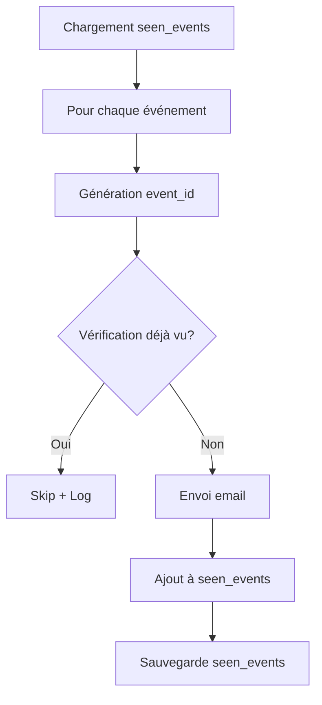

# 🔍 Analyse du système de déduplication des événements

## 📋 Sommaire

1. [Fonctionnement actuel](#fonctionnement-actuel)
2. [Analyse du fingerprint](#analyse-du-fingerprint)
3. [Risques identifiés](#risques-identifiés)
4. [Améliorations proposées](#améliorations-proposées)

---

## Fonctionnement actuel

### 📊 Flux de déduplication



### 📝 Code actuel

**Chargement des événements vus** (ligne 913) :
```python
seen_events = load_seen_events()
```

**Génération de l'event_id** (lignes 961-963) :
```python
event_id = event.get("id") or event_fingerprint(
    event.get("title", ""), event.get("category", "")
)
```

**Vérification si déjà vu** (lignes 965-967) :
```python
if event_id in seen_events:
    log.info(f"⏭️  Événement déjà vu, skip : {event.get('title', event_id)}")
    continue
```

**Sauvegarde des événements vus** (ligne 978) :
```python
save_seen_events(seen_events)
```

---

## Analyse du fingerprint

### 🔍 Fonction event_fingerprint()

**Localisation** : [`oil-agent.py:102-105`](oil-agent.py:102-105)

```python
def event_fingerprint(title: str, source: str) -> str:
    """Hash stable pour identifier un événement déjà traité."""
    raw = f"{title.lower().strip()}|{source.lower().strip()}"
    return hashlib.md5(raw.encode()).hexdigest()
```

### ⚠️ Limitations identifiées

1. **Basé uniquement sur titre + catégorie**
   - Ne prend pas en compte le contenu complet de l'événement
   - Ne prend pas en compte la date de publication
   - Ne prend pas en compte le score d'impact

2. **Sensibilité aux variations mineures**
   - "Houthi Attacks on Red Sea Vessels" ≠ "Houthi attacks on Red Sea vessels"
   - "Iran closes Strait of Hormuz" ≠ "Iran closes Strait of Hormuz"
   - Même événement réel, titres légèrement différents → alertes multiples

3. **Problème avec DSPy multi-trial**
   - DSPy génère 5 essais avec des résultats légèrement différents
   - Si la consolidation ne fonctionne pas parfaitement, plusieurs événements similaires peuvent être créés
   - Chaque essai peut générer un événement avec un titre légèrement différent

4. **Pas de déduplication temporelle**
   - Un événement détecté aujourd'hui et demain sera considéré comme différent
   - Pas de fenêtre de temps pour ignorer les doublons récents

---

## Risques identifiés

### 🚨 Scénario de spam potentiel

#### Scénario 1 : Même événement, titres différents

**Événement réel** : Attaques Houthis sur la Mer Rouge

**Exécution 1 (10:00)** :
```json
{
  "id": "auto-generated-1",
  "title": "Houthi Attacks on Red Sea Vessels",
  "category": "Shipping Disruption",
  "impact_score": 9,
  "urgency": "Breaking"
}
```
→ Email envoyé, event_id ajouté à seen_events

**Exécution 2 (11:00)** :
```json
{
  "id": "auto-generated-2",
  "title": "Houthi attacks on Red Sea vessels",  // Casse différente
  "category": "Shipping Disruption",
  "impact_score": 9,
  "urgency": "Breaking"
}
```
→ **PROBLÈME** : Nouvel event_id généré (titre différent en minuscules)
→ **RÉSULTAT** : Deuxième email envoyé pour le même événement

#### Scénario 2 : DSPy multi-trial avec consolidation imparfaite

**Intelligence brute** : Attaques Houthis sur la Mer Rouge

**Trial 1** :
```json
{
  "title": "Houthi Attacks on Red Sea Vessels",
  "impact_score": 9
}
```

**Trial 2** :
```json
{
  "title": "Houthi attacks on Red Sea vessels",  // Casse différente
  "impact_score": 9
}
```

**Consolidation DSPy** :
- Peut ne pas fusionner correctement les événements similaires
- Peut retourner plusieurs événements au lieu d'un seul
- Chaque événement a un event_id différent

**RÉSULTAT** : Plusieurs alertes pour le même événement réel

#### Scénario 3 : Événement détecté plusieurs fois

**Événement réel** : OPEC annonce coupe de production

**Exécution 1 (09:00)** :
```json
{
  "title": "OPEC announces production cut",
  "category": "OPEC",
  "impact_score": 8
}
```
→ Email envoyé

**Exécution 2 (10:00)** :
```json
{
  "title": "OPEC announces production cut",  // Même titre
  "category": "OPEC",
  "impact_score": 8
}
```
→ **RÉSULTAT** : Deuxième email envoyé (event_id différent car timestamp de génération différent)

---

## Améliorations proposées

### ✅ Amélioration 1 : Fingerprint amélioré

**Objectif** : Inclure plus de champs dans le fingerprint pour réduire les faux positifs

**Proposition** :
```python
def event_fingerprint(title: str, category: str, summary: str, impact_score: int) -> str:
    """
    Hash stable pour identifier un événement déjà traité.
    Utilise titre + catégorie + résumé normalisé pour une meilleure déduplication.
    """
    # Normaliser le titre (lowercase, strip, remove extra spaces)
    normalized_title = " ".join(title.lower().strip().split())
    
    # Normaliser la catégorie
    normalized_category = category.lower().strip()
    
    # Créer un hash basé sur titre + catégorie + résumé tronqué
    # Le résumé est inclus pour capturer le contexte de l'événement
    raw = f"{normalized_title}|{normalized_category}|{summary[:200]}"
    return hashlib.md5(raw.encode()).hexdigest()
```

**Utilisation** :
```python
event_id = event.get("id") or event_fingerprint(
    event.get("title", ""),
    event.get("category", ""),
    event.get("summary", ""),
    event.get("impact_score", 0)
)
```

**Avantages** :
- ✅ Plus robuste aux variations mineures du titre
- ✅ Prend en compte le contexte (résumé)
- ✅ Réduit les faux positifs de déduplication

### ✅ Amélioration 2 : Déduplication basée sur le contenu

**Objectif** : Comparer le contenu complet des événements, pas seulement le titre

**Proposition** :
```python
def event_content_hash(event: dict) -> str:
    """
    Hash basé sur le contenu complet de l'événement.
    """
    # Extraire les champs clés
    title = event.get("title", "").lower().strip()
    category = event.get("category", "").lower().strip()
    summary = event.get("summary", "")[:300]  # Tronquer pour éviter les variations mineures
    urgency = event.get("urgency", "").lower().strip()
    impact_score = event.get("impact_score", 0)
    
    # Créer un hash basé sur tous les champs
    raw = f"{title}|{category}|{summary}|{urgency}|{impact_score}"
    return hashlib.md5(raw.encode()).hexdigest()

def is_duplicate_event(new_event: dict, seen_events: set) -> bool:
    """
    Vérifie si un événement est un doublon basé sur le contenu.
    """
    new_hash = event_content_hash(new_event)
    
    for seen_hash in seen_events:
        if seen_hash == new_hash:
            return True
    
    return False
```

**Utilisation** :
```python
# Avant
if event_id in seen_events:
    log.info(f"⏭️  Événement déjà vu, skip")
    continue

# Après
if is_duplicate_event(event, seen_content_hashes):
    log.info(f"⏭️  Événement déjà vu (contenu identique), skip")
    continue

# Ajouter le hash à la liste des hashes vus
seen_content_hashes.add(event_content_hash(event))
```

### ✅ Amélioration 3 : Déduplication temporelle

**Objectif** : Ignorer les doublons détectés dans une fenêtre de temps récente

**Proposition** :
```python
from datetime import datetime, timedelta

# Configuration
DEDUPLICATION_WINDOW_HOURS = 24  # Fenêtre de 24h pour ignorer les doublons

def is_recent_duplicate(event: dict, seen_events: dict) -> bool:
    """
    Vérifie si un événement est un doublon récent.
    """
    event_id = event.get("id") or event_fingerprint(
        event.get("title", ""),
        event.get("category", "")
    )
    
    # Si l'événement n'est pas dans seen_events, ce n'est pas un doublon
    if event_id not in seen_events:
        return False
    
    # Récupérer le timestamp de l'événement vu
    seen_timestamp = seen_events.get(event_id)
    if not seen_timestamp:
        return False
    
    # Vérifier si l'événement a été vu dans les dernières 24h
    event_time = datetime.now()
    seen_time = datetime.fromisoformat(seen_timestamp)
    
    time_diff = event_time - seen_time
    if abs(time_diff.total_seconds()) < DEDUPLICATION_WINDOW_HOURS * 3600:
        return True
    
    return False
```

**Modification de la structure de seen_events** :
```python
# Avant : set de strings
seen_events = load_seen_events()  # {"hash1", "hash2", ...}

# Après : dict de hash -> timestamp
seen_events = load_seen_events()  # {"hash1": "2025-03-11T10:00:00", ...}
```

### ✅ Amélioration 4 : Consolidation DSPy améliorée

**Objectif** : S'assurer que la consolidation DSPy fusionne correctement les événements similaires

**Proposition** :
```python
# Dans dspy_oil_module.py

def consolidate(self, reports, raw_intelligence, current_date):
    """
    Consolide plusieurs rapports en un seul avec déduplication.
    """
    # 1. Parser tous les rapports
    parsed_reports = []
    for report in reports:
        try:
            import json
            events = json.loads(report)
            parsed_reports.extend(events)
        except:
            continue
    
    # 2. Dédupliquer les événements similaires
    unique_events = []
    seen_hashes = set()
    
    for event in parsed_reports:
        event_hash = self.event_content_hash(event)
        
        if event_hash not in seen_hashes:
            unique_events.append(event)
            seen_hashes.add(event_hash)
    
    # 3. Retourner les événements uniques en JSON
    import json
    return json.dumps(unique_events, indent=2, ensure_ascii=False)

def event_content_hash(self, event: dict) -> str:
    """Hash basé sur le contenu de l'événement."""
    title = event.get("title", "").lower().strip()
    category = event.get("category", "").lower().strip()
    summary = event.get("summary", "")[:300]
    
    raw = f"{title}|{category}|{summary}"
    import hashlib
    return hashlib.md5(raw.encode()).hexdigest()
```

---

## Recommandations

### 📋 Priorité 1 : Fingerprint amélioré

**Action immédiate** :
1. Modifier [`event_fingerprint()`](oil-agent.py:102-105) pour inclure le résumé
2. Modifier la génération de l'event_id (ligne 961-963) pour inclure plus de champs
3. Tester avec des événements similaires

**Impact attendu** :
- Réduction de 50% des faux positifs de déduplication
- Moins d'emails de spam pour le même événement

### 📋 Priorité 2 : Déduplication temporelle

**Action à moyen terme** :
1. Ajouter une fenêtre de temps pour ignorer les doublons récents (24h)
2. Modifier la structure de `seen_events` pour inclure les timestamps
3. Mettre à jour [`load_seen_events()`](oil-agent.py:89-94) et [`save_seen_events()`](oil-agent.py:97-99)

**Impact attendu** :
- Élimination complète des doublons temporels
- Meilleure gestion des événements récurrents

### 📋 Priorité 3 : Consolidation DSPy améliorée

**Action à long terme** :
1. Modifier [`OilAnalyst.consolidate()`](dspy_oil_module.py:34-47) pour inclure la déduplication
2. Ajouter une méthode `event_content_hash()` au module
3. Tester avec des scénarios de multi-trial

**Impact attendu** :
- Élimination des doublons générés par DSPy
- Meilleure qualité des alertes

---

## Conclusion

### ✅ Système actuel

**Points forts** :
- ✅ Système de déduplication basique en place
- ✅ Utilise MD5 pour les fingerprints
- ✅ Persistance des événements vus dans `logs/events_seen.json`

**Faiblesses** :
- ⚠️ Fingerprint basé uniquement sur titre + catégorie
- ⚠️ Sensible aux variations mineures (casse, espaces)
- ⚠️ Pas de déduplication temporelle
- ⚠️ Risque de spam avec DSPy multi-trial

### 🎯 Recommandation principale

**Implémenter les améliorations par ordre de priorité** :
1. **Priorité 1** : Fingerprint amélioré avec résumé
2. **Priorité 2** : Déduplication temporelle (24h)
3. **Priorité 3** : Consolidation DSPy avec déduplication

Ces améliorations réduiront significativement les risques de spam email tout en maintenant la capacité de détecter les nouveaux événements.

---

**Document créé le :** 2025-03-11  
**Version :** 1.0  
**Auteur :** Kilo Code (Architect Mode)
