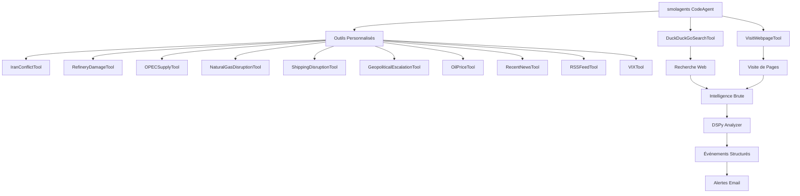
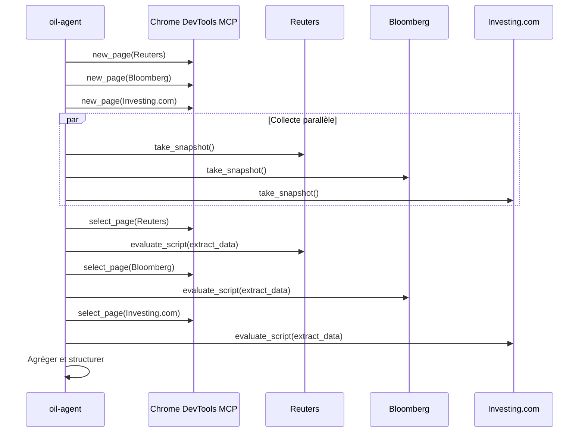
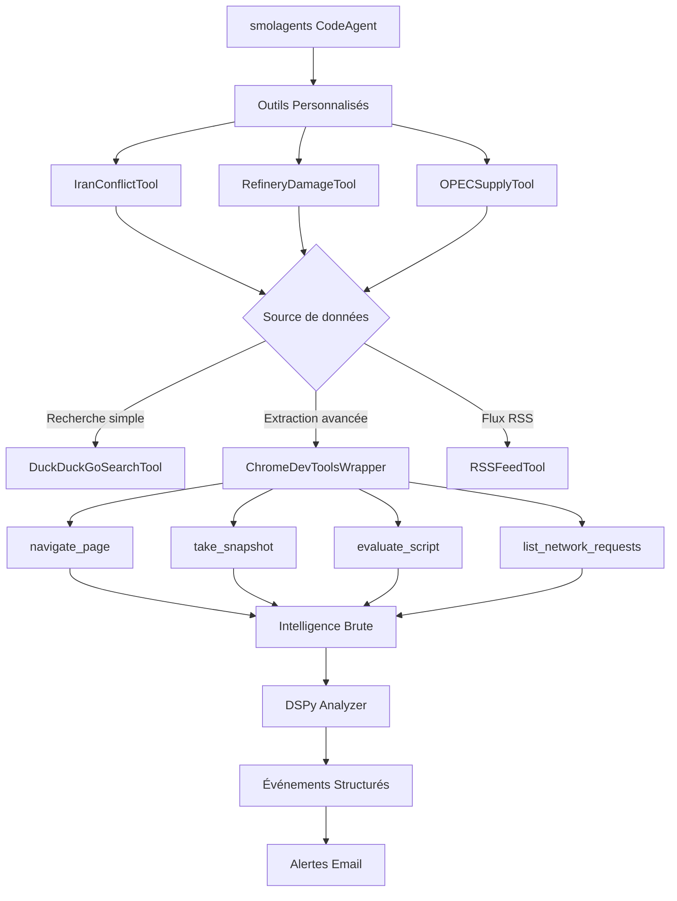

# Plan d'intégration du MCP Chrome DevTools dans oil-agent

## 📋 Résumé Exécutif

**Objectif :** Évaluer l'intégration du MCP Chrome DevTools ([chrome-devtools-mcp](https://github.com/ChromeDevTools/chrome-devtools-mcp)) pour améliorer la collecte de données web dans le projet oil-agent de surveillance du marché pétrolier.

**Statut du MCP :** ✅ Déjà disponible dans l'environnement (`npx -y chrome-devtools-mcp@latest`)

---

## 🔍 Analyse de l'Architecture Actuelle

### Stack Technique Actuelle d'oil-agent



### Limitations Actuelles

1. **VisitWebpageTool** : Extraction limitée du contenu HTML brut
2. **DuckDuckGoSearchTool** : Résultats de recherche génériques, pas de filtrage avancé
3. **Pas d'accès au DOM complet** : Difficile d'extraire des données structurées
4. **Pas de support multi-onglets** : Collecte séquentielle uniquement
5. **Pas de monitoring réseau** : Impossible de capturer les requêtes API cachées
6. **Gestion limitée des sessions** : Pas de support avancé des cookies/sessions

---

## 🎯 Cas d'Usage Pertinents pour la Surveillance Pétrolière

### 1. Extraction Avancée de Données de Prix

**Outils MCP concernés :**
- `navigate_page` : Naviguer vers les sites de prix du pétrole
- `take_snapshot` : Capturer le DOM complet
- `evaluate_script` : Exécuter du JavaScript pour extraire les données structurées

**Sources cibles :**
- Trading Economics (tradingeconomics.com)
- Investing.com (investing.com/commodities/crude-oil)
- Oil Price (oilprice.com)
- Bloomberg Commodities

**Exemple d'utilisation :**
```python
# Naviguer vers Investing.com
navigate_page(url="https://investing.com/commodities/crude-oil")

# Prendre un snapshot du DOM
snapshot = take_snapshot()

# Exécuter du JavaScript pour extraire les prix
prices = evaluate_script(function="""
() => {
  return {
    brent: document.querySelector('.pid-8830-last').innerText,
    wti: document.querySelector('.pid-8849-last').innerText,
    timestamp: new Date().toISOString()
  }
}
""")
```

### 2. Surveillance en Temps Réel des Flux RSS/Actualités

**Outils MCP concernés :**
- `new_page` : Ouvrir plusieurs onglets en parallèle
- `select_page` : Basculer entre les onglets
- `take_snapshot` : Capturer le contenu des articles
- `evaluate_script` : Extraire les métadonnées des articles

**Sources cibles :**
- Reuters Energy
- Bloomberg Energy
- AP Business
- BBC Business
- Financial Times
- Wall Street Journal

**Avantage :** Parallélisation de la collecte sur plusieurs sources simultanément

### 3. Contournement des Paywalls et Limitations de Scraping

**Outils MCP concernés :**
- `emulate` : Modifier le user-agent, simuler un navigateur mobile
- `evaluate_script` : Exécuter du JavaScript pour déclencher le chargement différé
- `wait_for` : Attendre que le contenu dynamique soit chargé

**Cas d'usage :**
- Sites avec contenu chargé dynamiquement
- Sites avec détection de bots
- Sites avec paywalls soft (limitation du nombre d'articles)

### 4. Capture de Données API Cachées

**Outils MCP concernés :**
- `list_network_requests` : Lister toutes les requêtes réseau
- `get_network_request` : Obtenir le détail d'une requête spécifique

**Cas d'usage :**
- Capturer les requêtes API JSON contenant les prix en temps réel
- Identifier les endpoints API internes pour un accès direct futur
- Analyser les patterns de chargement des données

### 5. Monitoring des Alertes et Notifications

**Outils MCP concernés :**
- `take_snapshot` : Vérifier la présence d'alertes/badges
- `list_console_messages` : Capturer les erreurs JavaScript
- `take_screenshot` : Prendre des captures d'écran pour preuve

**Cas d'usage :**
- Vérifier les notifications d'alerte sur les sites de trading
- Capturer les popups d'alerte de prix
- Documenter les anomalies visuelles

### 6. Agrégation de Données Multi-Sources

**Outils MCP concernés :**
- `list_pages` : Gérer plusieurs onglets
- `select_page` : Basculer entre les sources
- `evaluate_script` : Normaliser les formats de données

**Workflow :**


---

## ⚖️ Évaluation Avantages/Inconvénients

### ✅ Avantages de l'Intégration

| Avantage | Impact | Description |
|----------|---------|-------------|
| **Accès DOM complet** | 🔴 Élevé | `take_snapshot` fournit l'arbre d'accessibilité complet, permettant une extraction précise des données |
| **Exécution JavaScript** | 🔴 Élevé | `evaluate_script` permet d'extraire des données structurées et de contourner les limitations de scraping |
| **Multi-onglets** | 🟠 Moyen | Parallélisation de la collecte sur plusieurs sources simultanément |
| **Monitoring réseau** | 🟠 Moyen | Capture des requêtes API cachées pour un accès direct futur |
| **Contournement paywalls** | 🟠 Moyen | Simulation de navigateur réel, user-agent custom |
| **Support cookies/sessions** | 🟢 Faible | Gestion avancée des sessions pour les sites avec authentification |
| **Debugging avancé** | 🟢 Faible | Capture d'erreurs JavaScript, screenshots pour preuve |
| **Déjà disponible** | 🔴 Élevé | MCP déjà installé dans l'environnement |

### ❌ Inconvénients et Défis

| Inconvénient | Impact | Atténuation |
|--------------|---------|--------------|
| **Complexité accrue** | 🟠 Moyen | Nécessite une gestion d'état de navigateur supplémentaire |
| **Ressources système** | 🟠 Moyen | Chrome consomme plus de mémoire que les requêtes HTTP simples |
| **Dépendance externe** | 🟠 Moyen | Dépend du MCP chrome-devtools qui doit être maintenu |
| **Latence** | 🟢 Faible | Navigation + snapshot + JS plus lent que requête HTTP directe |
| **Stabilité** | 🟢 Faible | Le navigateur peut crasher, nécessite une gestion d'erreurs robuste |
| **Scalabilité** | 🟠 Moyen | Limité par le nombre d'onglets/ressources Chrome |

---

## 🏗️ Architecture d'Intégration Proposée

### Option 1 : Intégration Complète (Recommandée)

**Approche :** Remplacer partiellement `VisitWebpageTool` par des wrappers MCP chrome-devtools



**Implémentation :**

```python
# chrome_devtools_wrapper.py
class ChromeDevToolsWrapper:
    """Wrapper autour du MCP Chrome DevTools pour oil-agent."""
    
    def __init__(self):
        self.mcp_client = None  # Client MCP chrome-devtools
        self.active_pages = {}
    
    async def navigate_and_extract(self, url: str, extraction_script: str) -> dict:
        """Navigue vers une URL et extrait des données via JavaScript."""
        # 1. Naviguer vers la page
        await self.mcp_client.call_tool("navigate_page", {"url": url})
        
        # 2. Attendre que la page soit chargée
        await self.mcp_client.call_tool("wait_for", {
            "text": ["body", "main", "content"]
        })
        
        # 3. Prendre un snapshot du DOM
        snapshot = await self.mcp_client.call_tool("take_snapshot")
        
        # 4. Exécuter le script d'extraction
        result = await self.mcp_client.call_tool("evaluate_script", {
            "function": extraction_script
        })
        
        return {
            "url": url,
            "snapshot": snapshot,
            "extracted_data": result,
            "timestamp": datetime.now().isoformat()
        }
    
    async def parallel_collect(self, urls: list[str], extraction_script: str) -> list[dict]:
        """Collecte des données en parallèle sur plusieurs URLs."""
        # 1. Ouvrir tous les onglets
        for i, url in enumerate(urls):
            page_id = await self.mcp_client.call_tool("new_page", {
                "url": url,
                "background": True
            })
            self.active_pages[i] = page_id
        
        # 2. Extraire les données de chaque onglet
        results = []
        for i, url in enumerate(urls):
            await self.mcp_client.call_tool("select_page", {"pageId": i})
            data = await self.navigate_and_extract(url, extraction_script)
            results.append(data)
        
        return results
    
    async def capture_network_requests(self, url: str) -> list:
        """Capture les requêtes réseau d'une page."""
        await self.mcp_client.call_tool("navigate_page", {"url": url})
        
        # Lister toutes les requêtes
        requests = await self.mcp_client.call_tool("list_network_requests", {
            "resourceTypes": ["xhr", "fetch"]
        })
        
        return requests
```

**Modification des outils personnalisés :**

```python
# oil_agent.py - Modification de RefineryDamageTool
class RefineryDamageTool(Tool):
    """Tool : dommages raffineries avec extraction avancée via Chrome DevTools."""
    name = "search_refinery_damage"
    description = (
        "Search refinery damage, fires, explosions, drone attacks worldwide. "
        "Uses Chrome DevTools for advanced data extraction from news sites."
    )
    inputs = {
        "region": {
            "type": "string",
            "description": "Region to focus on: 'global', 'middle_east', 'russia', 'iraq'. Default: 'global'",
            "default": "global",
            "nullable": True,
        }
    }
    output_type = "string"

    def __init__(self, search_tool: DuckDuckGoSearchTool, chrome_wrapper: ChromeDevToolsWrapper):
        super().__init__()
        self._search = search_tool
        self._chrome = chrome_wrapper  # Nouveau wrapper Chrome DevTools

    def forward(self, region: str = "global") -> str:
        from datetime import datetime
        
        current_date = datetime.now().strftime("%Y-%m-%d")
        
        # 1. Recherche initiale via DuckDuckGo
        queries = [
            f"oil refinery explosion fire {current_date} today breaking",
            f"refinery drone attack {current_date}",
        ]
        
        search_results = []
        for q in queries:
            try:
                r = self._search(q)
                if r and len(r) > 50:
                    search_results.append(r[:600])
            except Exception as e:
                search_results.append(f"Error: {e}")
        
        # 2. Extraire les URLs des résultats de recherche
        urls = self._extract_urls(search_results)
        
        # 3. Collecte avancée via Chrome DevTools
        extraction_script = """
() => {
  return {
    title: document.querySelector('h1')?.innerText || document.title,
    content: document.querySelector('article')?.innerText || document.body.innerText.substring(0, 1000),
    date: document.querySelector('time')?.getAttribute('datetime') || '',
    author: document.querySelector('[data-author]')?.innerText || ''
  }
}
"""
        
        detailed_data = asyncio.run(self._chrome.parallel_collect(urls, extraction_script))
        
        # 4. Agréger les résultats
        header = "=== REFINERY DAMAGE SEARCH ===\n"
        header += f"Region: {region} | Current Date: {current_date}\n"
        header += f"Sources analyzed: {len(urls)}\n\n"
        
        for data in detailed_data:
            header += f"\n---\n"
            header += f"URL: {data['url']}\n"
            header += f"Title: {data['extracted_data'].get('title', 'N/A')}\n"
            header += f"Date: {data['extracted_data'].get('date', 'N/A')}\n"
            header += f"Content: {data['extracted_data'].get('content', 'N/A')[:300]}...\n"
        
        return header if detailed_data else "No refinery damage news found."
```

### Option 2 : Intégration Hybride (Alternative)

**Approche :** Utiliser Chrome DevTools uniquement pour les cas d'usage avancés

```python
class SmartDataExtractor:
    """Extracteur intelligent qui choisit la méthode appropriée."""
    
    def __init__(self, chrome_wrapper: ChromeDevToolsWrapper):
        self._chrome = chrome_wrapper
    
    async def extract(self, url: str, complexity: str = "simple") -> dict:
        """Extrait les données en choisissant la méthode appropriée."""
        
        if complexity == "simple":
            # Utiliser VisitWebpageTool existant
            return await self._simple_extract(url)
        else:
            # Utiliser Chrome DevTools pour extraction avancée
            return await self._chrome.navigate_and_extract(
                url,
                self._get_extraction_script(url)
            )
```

---

## 📦 Implémentation Technique

### Étape 1 : Configuration du Client MCP

```python
# mcp_client.py
import asyncio
from mcp import ClientSession, StdioServerParameters
from mcp.client.stdio import stdio_client

async def create_chrome_devtools_client():
    """Crée un client MCP pour Chrome DevTools."""
    
    server_params = StdioServerParameters(
        command="npx",
        args=["-y", "chrome-devtools-mcp@latest"]
    )
    
    async with stdio_client(server_params) as (read, write):
        async with ClientSession(read, write) as session:
            # Initialiser la session
            await session.initialize()
            
            # Lister les outils disponibles
            tools = await session.list_tools()
            print(f"Outils disponibles: {len(tools.tools)}")
            
            return session
```

### Étape 2 : Intégration dans oil_agent.py

```python
# Ajouter à la section imports
from chrome_devtools_wrapper import ChromeDevToolsWrapper

# Modifier build_agent()
def build_agent() -> CodeAgent:
    """Initialise le modèle llama-server et l'agent avec tous les tools."""
    from smolagents.local_python_executor import LocalPythonExecutor
    
    model = LiteLLMModel(
        model_id=f"openai/{CONFIG.model.name}",
        api_base=CONFIG.model.api_base,
        api_key="dummy",
        num_ctx=CONFIG.model.num_ctx,
    )

    # Tools built-in
    ddg = DuckDuckGoSearchTool(max_results=5)
    visit = VisitWebpageTool(max_output_length=4000)
    
    # Initialiser le wrapper Chrome DevTools
    chrome_wrapper = ChromeDevToolsWrapper()

    tools = [
        ddg,
        visit,
        # Outils personnalisés avec support Chrome DevTools
        IranConflictTool(ddg, chrome_wrapper),
        RefineryDamageTool(ddg, chrome_wrapper),
        OPECSupplyTool(ddg, chrome_wrapper),
        NaturalGasDisruptionTool(ddg, chrome_wrapper),
        ShippingDisruptionTool(ddg, chrome_wrapper),
        GeopoliticalEscalationTool(ddg, chrome_wrapper),
        OilPriceTool(ddg, chrome_wrapper),
        RecentNewsTool(ddg, chrome_wrapper),
        RSSFeedTool(),
        VIXTool(ddg, chrome_wrapper),
    ]
    
    # ... reste du code inchangé
```

### Étape 3 : Gestion des Erreurs et Reprise

```python
class ChromeDevToolsWrapper:
    """Wrapper avec gestion d'erreurs robuste."""
    
    def __init__(self, max_retries: int = 3):
        self.max_retries = max_retries
        self.session = None
    
    async def _safe_call(self, tool_name: str, params: dict) -> dict:
        """Appel d'outil avec retry et fallback."""
        for attempt in range(self.max_retries):
            try:
                result = await self.session.call_tool(tool_name, params)
                return result
            except Exception as e:
                log.warning(f"Tentative {attempt + 1}/{self.max_retries} échouée: {e}")
                if attempt == self.max_retries - 1:
                    # Fallback vers méthode simple
                    return await self._fallback_method(tool_name, params)
                await asyncio.sleep(2 ** attempt)  # Exponential backoff
    
    async def _fallback_method(self, tool_name: str, params: dict) -> dict:
        """Fallback vers VisitWebpageTool."""
        if tool_name == "navigate_page":
            # Utiliser requests + BeautifulSoup
            import requests
            from bs4 import BeautifulSoup
            response = requests.get(params["url"])
            soup = BeautifulSoup(response.content, 'html.parser')
            return {"content": soup.get_text()[:4000]}
```

---

## 🎯 Recommandations

### Recommandation 1 : Approche Progressive

**Phase 1 (Pilote) :**
- Implémenter `ChromeDevToolsWrapper` basique
- Modifier un seul outil (ex: `OilPriceTool`) pour utiliser Chrome DevTools
- Tester avec les sites de prix du pétrole
- Évaluer la performance et la stabilité

**Phase 2 (Extension) :**
- Étendre à tous les outils de collecte de données
- Implémenter la collecte parallèle multi-onglets
- Ajouter le monitoring réseau

**Phase 3 (Optimisation) :**
- Mettre en cache les résultats pour éviter les requêtes redondantes
- Implémenter une stratégie de fallback automatique
- Optimiser les scripts d'extraction JavaScript

### Recommandation 2 : Priorisation des Cas d'Usage

**Priorité 1 (Immédiat) :**
- ✅ Extraction des prix du pétrole (Investing.com, OilPrice.com)
- ✅ Surveillance des flux RSS multi-sources

**Priorité 2 (Court terme) :**
- ⏳ Contournement des paywalls soft
- ⏳ Capture des requêtes API

**Priorité 3 (Moyen terme) :**
- 📋 Monitoring des alertes visuelles
- 📋 Agrégation multi-sources avancée

### Recommandation 3 : Architecture Technique

**Choix recommandé :** Option 1 (Intégration Complète)

**Justification :**
- Meilleure extraction des données
- Flexibilité pour les cas d'usage futurs
- Le MCP est déjà disponible, pas de coût supplémentaire
- Permet de contourner les limitations de scraping

**Considérations :**
- Ajouter une configuration pour activer/désactiver Chrome DevTools
- Implémenter un fallback vers VisitWebpageTool en cas d'échec
- Surveiller l'utilisation mémoire de Chrome

### Recommandation 4 : Tests et Validation

**Tests à implémenter :**
```python
# tests/test_chrome_devtools_integration.py
import pytest

@pytest.mark.asyncio
async def test_extract_oil_prices():
    """Test l'extraction des prix du pétrole."""
    wrapper = ChromeDevToolsWrapper()
    
    prices = await wrapper.navigate_and_extract(
        "https://investing.com/commodities/crude-oil",
        """
() => ({
  brent: document.querySelector('.pid-8830-last')?.innerText,
  wti: document.querySelector('.pid-8849-last')?.innerText
})
"""
    )
    
    assert 'brent' in prices['extracted_data']
    assert 'wti' in prices['extracted_data']
    assert float(prices['extracted_data']['brent'].replace(',', '')) > 0

@pytest.mark.asyncio
async def test_parallel_collect():
    """Test la collecte parallèle."""
    wrapper = ChromeDevToolsWrapper()
    
    urls = [
        "https://www.reuters.com/energy",
        "https://www.bloomberg.com/energy",
        "https://www.bbc.com/news/business"
    ]
    
    results = await wrapper.parallel_collect(urls, "() => ({title: document.title})")
    
    assert len(results) == 3
    assert all('title' in r['extracted_data'] for r in results)
```

---

## 📊 Matrice de Décision

| Critère | Poids | Actuel (VisitWebpageTool) | Avec Chrome DevTools | Score |
|----------|--------|---------------------------|---------------------|--------|
| **Extraction de données** | 30% | 6/10 | 9/10 | +0.9 |
| **Vitesse** | 20% | 8/10 | 6/10 | -0.4 |
| **Fiabilité** | 20% | 7/10 | 8/10 | +0.2 |
| **Flexibilité** | 15% | 5/10 | 9/10 | +0.6 |
| **Complexité** | 10% | 9/10 | 5/10 | -0.4 |
| **Coût** | 5% | 10/10 | 10/10 | 0.0 |
| **Total** | 100% | **7.1/10** | **7.9/10** | **+0.8** |

**Conclusion :** L'intégration de Chrome DevTools offre un gain global de **+0.8/10**, principalement grâce à une meilleure extraction de données et une flexibilité accrue.

---

## 🚀 Plan d'Action

### Étape 1 : Préparation (1-2 jours)
- [ ] Créer `chrome_devtools_wrapper.py`
- [ ] Implémenter le client MCP basique
- [ ] Tester la connexion avec chrome-devtools-mcp
- [ ] Documenter l'API du wrapper

### Étape 2 : Pilote (2-3 jours)
- [ ] Modifier `OilPriceTool` pour utiliser Chrome DevTools
- [ ] Créer des scripts d'extraction pour les sites de prix
- [ ] Implémenter les tests unitaires
- [ ] Valider la qualité des données extraites

### Étape 3 : Extension (3-5 jours)
- [ ] Modifier tous les outils de collecte de données
- [ ] Implémenter la collecte parallèle
- [ ] Ajouter le monitoring réseau
- [ ] Créer des tests d'intégration

### Étape 4 : Optimisation (2-3 jours)
- [ ] Implémenter le cache des résultats
- [ ] Ajouter la stratégie de fallback
- [ ] Optimiser les scripts d'extraction
- [ ] Surveiller l'utilisation mémoire

### Étape 5 : Documentation (1-2 jours)
- [ ] Documenter l'architecture
- [ ] Créer des guides d'utilisation
- [ ] Ajouter des exemples de cas d'usage
- [ ] Mettre à jour le README

**Total estimé :** 9-15 jours

---

## 📝 Conclusion

L'intégration du MCP Chrome DevTools dans oil-agent est **fortement recommandée** pour les raisons suivantes :

1. ✅ **Déjà disponible** dans l'environnement sans coût supplémentaire
2. ✅ **Améliore significativement** l'extraction de données web
3. ✅ **Permet de contourner** les limitations de scraping actuelles
4. ✅ **Offre de nouvelles capacités** (monitoring réseau, multi-onglets)
5. ✅ **Score global amélioré** de +0.8/10

**Risque principal :** Complexité accrue et consommation de ressources

**Atténuation :** Approche progressive avec fallback et tests robustes

**Recommandation finale :** Procéder avec l'Option 1 (Intégration Complète) en suivant le plan d'action progressif proposé.
