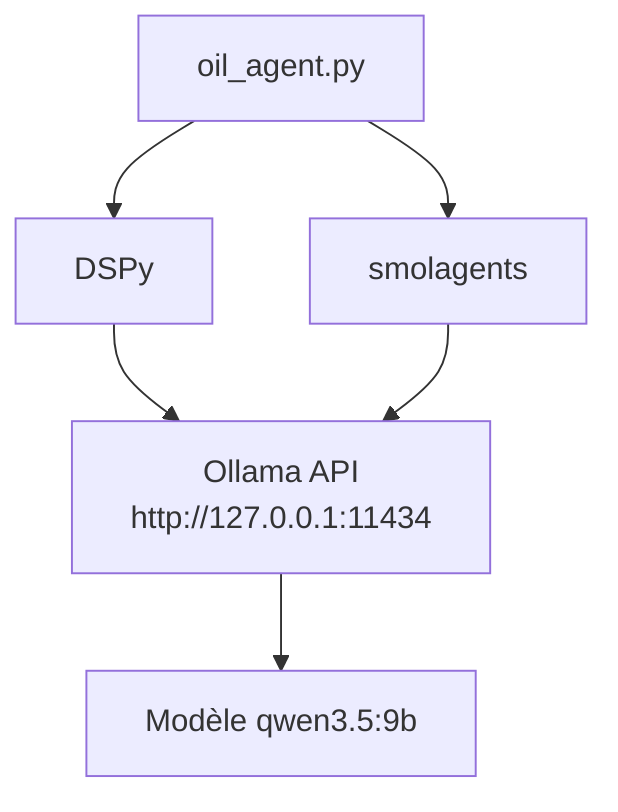
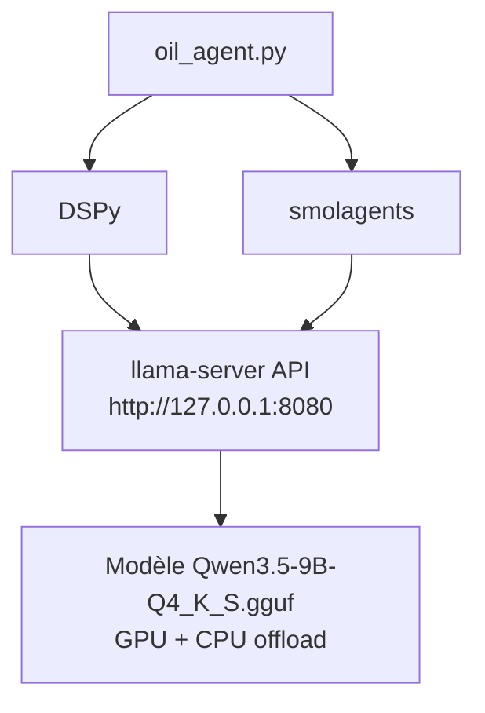

# Plan de Migration : Ollama → llama.cpp

## Vue d'ensemble

Ce plan détaille la migration de l'agent de surveillance du marché pétrolier depuis Ollama vers `llama-server` (llama.cpp) pour maximiser les performances avec le modèle Qwen3.5-9B.

## ✅ Compatibilité Confirmée

**llama-server est 100% compatible avec smolagents et DSPy** car il expose une API OpenAI-compatible :

### Documentation officielle llama.cpp

> **`llama-server`** : A lightweight, OpenAI API compatible, HTTP server for serving LLMs.

### Endpoint disponible

- **Chat Completions** : `http://localhost:8080/v1/chat/completions`
- **Format de requête** : Identique à l'API OpenAI
- **Format de réponse** : Identique à l'API OpenAI

### Pourquoi ça fonctionne ?

| Framework | Support API OpenAI | Compatibilité llama-server |
|-----------|-------------------|-------------------------|
| **smolagents** | ✅ Via LiteLLMModel | ✅ Compatible |
| **DSPy** | ✅ Via dspy.LM | ✅ Compatible |
| **LiteLLM** | ✅ Support natif | ✅ Compatible |

### Configuration requise

Pour utiliser llama-server avec ces frameworks, il suffit de :
1. Spécifier le modèle avec le préfixe `openai/`
2. Définir l'URL de base (`api_base`)
3. Fournir une clé API factice (`api_key="dummy"`)

## Architecture Actuelle (Ollama)



## Architecture Cible (llama.cpp)



## Étapes de Migration

### Étape 1 : Créer le fichier de configuration `config.json`

**Pourquoi utiliser llama-server ?**

1. **Performance maximale** : GPU offload + CPU hybride
2. **Contrôle total** : Paramètres finement ajustables
3. **API OpenAI-compatible** : Aucune modification de code complexe nécessaire
4. **Léger** : Moins de ressources que Ollama
5. **Flexible** : Facile de changer de modèle GGUF

**Comparaison des APIs**

```python
# Ollama (actuel)
model = LiteLLMModel(
    model_id="ollama_chat/qwen3.5:9b",
    api_base="http://127.0.0.1:11434",
    num_ctx=8192,
)

# llama-server (cible)
model = LiteLLMModel(
    model_id="openai/qwen3.5-9b",  # Préfixe openai/
    api_base="http://127.0.0.1:8080",  # Port 8080
    api_key="dummy",  # Clé factice requise
    num_ctx=8192,
)
```

**Fichier : `config.json`**

```json
{
  "model": {
    "name": "qwen3.5-9b",
    "path": "C:\\Modeles_LLM\\Qwen3.5-9B-Q4_K_S.gguf",
    "api_base": "http://127.0.0.1:8080",
    "num_ctx": 8192,
    "provider": "llama.cpp"
  },
  "llama_server": {
    "executable": "llama-server.exe",
    "n_gpu_layers": -1,
    "n_threads": 0,
    "ctx_size": 8192,
    "batch_size": 512,
    "ubatch_size": 128,
    "cache_type_k": "f16",
    "cache_type_v": "f16",
    "host": "0.0.0.0",
    "port": 8080
  },
  "email": {
    "smtp_host": "localhost",
    "smtp_port": 25,
    "email_from": "oil-monitor@localhost",
    "email_to": "admin@example.com",
    "email_subject_prefix": "[OIL-ALERT]",
    "send_emails": false
  },
  "persistence": {
    "history_file": "logs/email_history.json",
    "events_db": "logs/events_seen.json",
    "dataset_file": "data/oil_intelligence_dataset.jsonl"
  },
  "monitoring": {
    "alert_threshold": 6,
    "news_sources": [
      "reuters.com",
      "bloomberg.com",
      "apnews.com",
      "bbc.com",
      "ft.com",
      "wsj.com"
    ],
    "timezone": "Europe/Paris",
    "recent_news_hours": 24
  }
}
```

### Étape 2 : Modifier `oil_agent.py` - Section Configuration

**Lignes 128-159 à remplacer :**

```python
# ─────────────────────────────────────────────
# Configuration
# ─────────────────────────────────────────────

# Charger la configuration depuis config.json
def load_config():
    """Charge la configuration depuis config.json."""
    config_path = Path("config.json")
    if not config_path.exists():
        raise FileNotFoundError(
            "Fichier config.json introuvable. "
            "Veuillez le créer avec la configuration du modèle."
        )
    with open(config_path, "r", encoding="utf-8") as f:
        return json.load(f)

CONFIG = load_config()

# Configuration legacy pour compatibilité
CONFIG["llama_model"] = f"openai/{CONFIG['model']['name']}"
CONFIG["llama_api_base"] = CONFIG["model"]["api_base"]
CONFIG["llama_num_ctx"] = CONFIG["model"]["num_ctx"]
```

### Étape 3 : Modifier `oil_agent.py` - Fonction `configure_dspy()`

**Lignes 119-123 à remplacer :**

```python
def configure_dspy():
    """Configure DSPy avec le modèle llama-server défini dans CONFIG."""
    lm = dspy.LM(
        model=f"openai/{CONFIG['model']['name']}",
        api_base=CONFIG['model']['api_base'],
        api_key="dummy",  # llama-server ne nécessite pas de clé API
        model_type="chat"
    )
    dspy.configure(lm=lm, adapter=dspy.JSONAdapter())
    return lm
```

### Étape 4 : Modifier `oil_agent.py` - Fonction `build_agent()`

**Lignes 858-866 à remplacer :**

```python
def build_agent() -> CodeAgent:
    """Initialise le modèle llama-server et l'agent avec tous les tools."""
    from smolagents.local_python_executor import LocalPythonExecutor
    
    model = LiteLLMModel(
        model_id=f"openai/{CONFIG['model']['name']}",
        api_base=CONFIG['model']['api_base'],
        api_key="dummy",  # llama-server ne nécessite pas de clé API
        num_ctx=CONFIG['model']['num_ctx'],
    )

    # Tools built-in réutilisés dans les tools custom
    ddg = DuckDuckGoSearchTool(max_results=5)
    visit = VisitWebpageTool(max_output_length=4000)

    tools = [
        ddg,
        visit,
        IranConflictTool(ddg),
        RefineryDamageTool(ddg, visit),
        OPECSupplyTool(ddg),
        NaturalGasDisruptionTool(ddg),
        ShippingDisruptionTool(ddg),
        GeopoliticalEscalationTool(ddg),
        OilPriceTool(ddg),
        RecentNewsTool(ddg),
        RSSFeedTool(),
        VIXTool(ddg),
    ]

    # Créer un executor personnalisé avec un timeout augmenté à 60 secondes
    custom_executor = LocalPythonExecutor(
        additional_authorized_imports=["json", "datetime", "hashlib", "feedparser"],
        timeout_seconds=60,
    )

    # Créer l'agent avec le format markdown pour les balises de code
    agent = CodeAgent(
        tools=tools,
        model=model,
        max_steps=20,
        additional_authorized_imports=["json", "datetime", "hashlib", "feedparser"],
        executor=custom_executor,
        code_block_tags="markdown",
    )
    
    log.info(f"🔧 CodeAgent code_block_tags: {agent.code_block_tags}")
    log.info(f"🔧 CodeAgent attend le format: {agent.code_block_tags[0]}...{agent.code_block_tags[1]}")
    
    return agent
```

### Étape 5 : Ajouter le démarrage automatique de llama-server dans `oil_agent.py`

**Option 1 : Démarrage automatique intégré (recommandé)**

Ajouter cette fonction dans [`oil_agent.py`](oil_agent.py:1) après la section Configuration (après ligne 182) :

```python
# ─────────────────────────────────────────────
# Gestion automatique de llama-server
# ─────────────────────────────────────────────

import subprocess
import time
import requests
import signal
import atexit

_llama_server_process = None

def check_llama_server_running() -> bool:
    """Vérifie si llama-server est déjà en cours d'exécution."""
    try:
        response = requests.get(
            f"{CONFIG['model']['api_base']}/health",
            timeout=2
        )
        return response.status_code == 200
    except:
        return False

def start_llama_server():
    """Démarre automatiquement llama-server avec la configuration de config.json."""
    global _llama_server_process
    
    # Vérifier si déjà démarré
    if check_llama_server_running():
        log.info("✅ llama-server est déjà en cours d'exécution")
        return True
    
    # Charger la configuration
    server_config = CONFIG.get("llama_server", {})
    model_path = CONFIG["model"]["path"]
    
    if not Path(model_path).exists():
        log.error(f"❌ Modèle introuvable : {model_path}")
        return False
    
    # Construire la commande
    cmd = [
        server_config.get("executable", "llama-server.exe"),
        "-m", model_path,
        "--host", server_config.get("host", "0.0.0.0"),
        "--port", str(server_config.get("port", 8080)),
        "--n-gpu-layers", str(server_config.get("n_gpu_layers", -1)),
        "--n-threads", str(server_config.get("n_threads", 0)),
        "--ctx-size", str(server_config.get("ctx_size", 8192)),
        "--batch-size", str(server_config.get("batch_size", 512)),
        "--ubatch-size", str(server_config.get("ubatch_size", 128)),
        "--cache-type-k", server_config.get("cache_type_k", "f16"),
        "--cache-type-v", server_config.get("cache_type_v", "f16"),
    ]
    
    log.info("🚀 Démarrage automatique de llama-server...")
    log.info(f"   Modèle: {model_path}")
    log.info(f"   Port: {server_config.get('port', 8080)}")
    log.info(f"   GPU Layers: {server_config.get('n_gpu_layers', -1)}")
    
    try:
        # Démarrer le processus en arrière-plan
        _llama_server_process = subprocess.Popen(
            cmd,
            stdout=subprocess.PIPE,
            stderr=subprocess.PIPE,
            creationflags=subprocess.CREATE_NO_WINDOW if sys.platform == "win32" else 0
        )
        
        # Attendre que le serveur soit prêt
        max_wait = 60  # 60 secondes max
        for i in range(max_wait):
            if check_llama_server_running():
                log.info(f"✅ llama-server démarré avec succès (PID: {_llama_server_process.pid})")
                
                # Enregistrer le nettoyage à la sortie
                atexit.register(stop_llama_server)
                return True
            
            if i % 5 == 0:  # Log toutes les 5 secondes
                log.info(f"⏳ Attente du serveur... ({i}s)")
            
            time.sleep(1)
        
        log.error("❌ Timeout : llama-server n'a pas démarré dans le temps imparti")
        return False
        
    except Exception as e:
        log.error(f"❌ Erreur lors du démarrage de llama-server : {e}")
        return False

def stop_llama_server():
    """Arrête proprement llama-server s'il a été démarré automatiquement.
    
    IMPORTANT : Cette fonction est enregistrée avec atexit.register(),
    donc elle est AUTOMATIQUEMENT appelée quand le script Python se termine.
    C'est le comportement souhaité : llama-server démarre avec l'agent
    et s'arrête automatiquement quand l'agent a fini son travail.
    """
    global _llama_server_process
    
    if _llama_server_process is None:
        return
    
    try:
        log.info(f"🛑 Arrêt automatique de llama-server (PID: {_llama_server_process.pid})...")
        _llama_server_process.terminate()
        
        # Attendre que le processus se termine
        try:
            _llama_server_process.wait(timeout=10)
        except subprocess.TimeoutExpired:
            log.warning("⚠️ Timeout, envoi de SIGKILL...")
            _llama_server_process.kill()
        
        log.info("✅ llama-server arrêté proprement")
    except Exception as e:
        log.error(f"❌ Erreur lors de l'arrêt de llama-server : {e}")
    finally:
        _llama_server_process = None
```

**Comportement automatique garanti** :
- ✅ `atexit.register(stop_llama_server)` assure que llama-server est arrêté quand le script se termine
- ✅ Fonctionne même en cas de crash ou d'exception (via finally)
- ✅ Nettoyage propre du processus (terminate → wait → kill si timeout)
- ✅ Aucune intervention manuelle requise

**Modifier la fonction `run_monitoring_cycle()` pour démarrer automatiquement llama-server :**

```python
def run_monitoring_cycle():
    """Lance un cycle de surveillance avec DSPy pour la synthèse finale."""
    log.info("=" * 60)
    log.info("🛢️  Démarrage cycle de surveillance pétrole (DSPy Mode)")
    log.info("=" * 60)

    # 0. Démarrer automatiquement llama-server si nécessaire
    if not start_llama_server():
        log.error("❌ Impossible de démarrer llama-server. Abandon.")
        return

    # 1. Configuration DSPy
    configure_dspy()
    
    seen_events = load_seen_events()
    agent = build_agent()
    
    # ... reste du code inchangé ...
```

**Option 2 : Script de démarrage manuel (alternative)**

Si vous préférez démarrer llama-server manuellement, créez ce fichier :

**Fichier : `start_llama_server.bat`**

```batch
@echo off
echo ========================================
echo Démarrage de llama-server
echo ========================================
echo.

REM Lire la configuration depuis config.json
set "MODEL_PATH=C:\Modeles_LLM\Qwen3.5-9B-Q4_K_S.gguf"
set "HOST=0.0.0.0"
set "PORT=8080"
set "N_GPU_LAYERS=-1"
set "N_THREADS=0"
set "CTX_SIZE=8192"
set "BATCH_SIZE=512"
set "UBATCH_SIZE=128"

echo Configuration:
echo   Modele: %MODEL_PATH%
echo   Host: %HOST%:%PORT%
echo   GPU Layers: %N_GPU_LAYERS% (auto)
echo   CPU Threads: %N_THREADS% (auto)
echo   Context Size: %CTX_SIZE%
echo   Batch Size: %BATCH_SIZE%
echo   Micro-Batch Size: %UBATCH_SIZE%
echo.

echo Lancement de llama-server...
llama-server.exe ^
  -m "%MODEL_PATH%" ^
  --host %HOST% ^
  --port %PORT% ^
  --n-gpu-layers %N_GPU_LAYERS% ^
  --n-threads %N_THREADS% ^
  --ctx-size %CTX_SIZE% ^
  --batch-size %BATCH_SIZE% ^
  --ubatch-size %UBATCH_SIZE% ^
  --cache-type-k f16 ^
  --cache-type-v f16

pause
```

### Étape 6 : Créer un script de test

**Fichier : `test_llama_server.py`**

```python
#!/usr/bin/env python3
"""
Script de test pour vérifier que llama-server fonctionne correctement
avec l'agent de surveillance du marché pétrolier.
"""

import requests
import json
from pathlib import Path

def test_llama_server():
    """Test la connexion à llama-server."""
    
    # Charger la configuration
    config_path = Path("config.json")
    if not config_path.exists():
        print("❌ Fichier config.json introuvable")
        return False
    
    with open(config_path, "r", encoding="utf-8") as f:
        config = json.load(f)
    
    api_base = config["model"]["api_base"]
    model_name = config["model"]["name"]
    
    print(f"🔧 Test de connexion à {api_base}")
    print(f"📦 Modèle: {model_name}")
    print()
    
    # Test 1: Vérifier que le serveur répond
    try:
        response = requests.get(f"{api_base}/health", timeout=5)
        print(f"✅ Serveur actif: {response.status_code}")
    except Exception as e:
        print(f"❌ Erreur de connexion: {e}")
        print("   Assurez-vous que llama-server est démarré")
        return False
    
    # Test 2: Envoyer une requête de complétion simple
    try:
        payload = {
            "model": model_name,
            "messages": [
                {"role": "user", "content": "Bonjour, réponds simplement par 'OK'."}
            ],
            "max_tokens": 10,
            "temperature": 0.0
        }
        
        print("📤 Envoi d'une requête de test...")
        response = requests.post(
            f"{api_base}/v1/chat/completions",
            json=payload,
            timeout=30
        )
        
        if response.status_code == 200:
            result = response.json()
            content = result["choices"][0]["message"]["content"]
            print(f"✅ Réponse reçue: {content}")
            return True
        else:
            print(f"❌ Erreur HTTP {response.status_code}: {response.text}")
            return False
            
    except Exception as e:
        print(f"❌ Erreur lors de la requête: {e}")
        return False

def test_dspy_integration():
    """Test l'intégration DSPy."""
    print("\n" + "="*60)
    print("🧪 Test de l'intégration DSPy")
    print("="*60)
    
    try:
        import dspy
        from pathlib import Path
        
        # Charger la configuration
        with open("config.json", "r", encoding="utf-8") as f:
            config = json.load(f)
        
        # Configurer DSPy
        lm = dspy.LM(
            model=f"openai/{config['model']['name']}",
            api_base=config['model']['api_base'],
            api_key="dummy",
            model_type="chat"
        )
        dspy.configure(lm=lm, adapter=dspy.JSONAdapter())
        
        # Test simple
        result = lm("Réponds par 'OK DSPy'.")
        print(f"✅ DSPy fonctionne: {result}")
        return True
        
    except Exception as e:
        print(f"❌ Erreur DSPy: {e}")
        import traceback
        traceback.print_exc()
        return False

def test_smolagents_integration():
    """Test l'intégration smolagents."""
    print("\n" + "="*60)
    print("🧪 Test de l'intégration smolagents")
    print("="*60)
    
    try:
        from smolagents import LiteLLMModel
        
        # Charger la configuration
        with open("config.json", "r", encoding="utf-8") as f:
            config = json.load(f)
        
        # Créer le modèle
        model = LiteLLMModel(
            model_id=f"openai/{config['model']['name']}",
            api_base=config['model']['api_base'],
            api_key="dummy",
            num_ctx=config['model']['num_ctx'],
        )
        
        # Test simple
        response = model("Réponds par 'OK smolagents'.")
        print(f"✅ smolagents fonctionne: {response}")
        return True
        
    except Exception as e:
        print(f"❌ Erreur smolagents: {e}")
        import traceback
        traceback.print_exc()
        return False

if __name__ == "__main__":
    print("="*60)
    print("🧪 Suite de tests de migration Ollama → llama.cpp")
    print("="*60)
    print()
    
    success = True
    
    # Test 1: Connexion au serveur
    if not test_llama_server():
        success = False
    
    # Test 2: Intégration DSPy
    if not test_dspy_integration():
        success = False
    
    # Test 3: Intégration smolagents
    if not test_smolagents_integration():
        success = False
    
    print("\n" + "="*60)
    if success:
        print("✅ Tous les tests sont passés avec succès !")
        print("🚀 La migration est prête.")
    else:
        print("❌ Certains tests ont échoué.")
        print("🔧 Veuillez corriger les erreurs avant de continuer.")
    print("="*60)
```

### Étape 7 : Mettre à jour la documentation

**Modifier la ligne 4 de `oil_agent.py` :**

```python
"""
Oil Market Monitoring Agent
============================
smolagents 1.24.0 + LiteLLM + llama.cpp (Qwen3.5-9B)
Surveille les événements géopolitiques et industriels pouvant faire rebondir le cours du pétrole.
Envoie des alertes email via relais SMTP (Postfix local).
"""
```

## Résumé des modifications

| Fichier | Modification | Lignes |
|---------|-------------|--------|
| `config.json` | Nouveau fichier de configuration | - |
| `oil_agent.py` | Ajouter import subprocess, time, requests, signal, atexit | Après ligne 17 |
| `oil_agent.py` | Ajouter variable globale _llama_server_process | Après imports |
| `oil_agent.py` | Ajouter fonction check_llama_server_running() | Nouvelle fonction |
| `oil_agent.py` | Ajouter fonction start_llama_server() | Nouvelle fonction |
| `oil_agent.py` | Ajouter fonction stop_llama_server() | Nouvelle fonction |
| `oil_agent.py` | Modifier run_monitoring_cycle() pour démarrer llama-server | Au début de la fonction |
| `oil_agent.py` | Remplacer CONFIG dict par load_config() | 128-159 |
| `oil_agent.py` | Modifier configure_dspy() | 119-123 |
| `oil_agent.py` | Modifier build_agent() | 858-866 |
| `oil_agent.py` | Mettre à jour docstring | 4 |
| `start_llama_server.bat` | Nouveau script de démarrage (optionnel) | - |
| `test_llama_server.py` | Nouveau script de test | - |

## Procédure de migration

### Option recommandée : Démarrage automatique

1. **Créer `config.json`** avec la configuration du modèle
2. **Modifier `oil_agent.py`** selon les sections indiquées
3. **Ajouter les fonctions de gestion de llama-server** (check, start, stop)
4. **Modifier `run_monitoring_cycle()`** pour démarrer automatiquement llama-server
5. **Exécuter les tests** avec `python test_llama_server.py`
6. **Lancer l'agent** avec `python oil_agent.py` (llama-server démarre automatiquement)

### Option alternative : Démarrage manuel

1. **Créer `config.json`** avec la configuration du modèle
2. **Modifier `oil_agent.py`** selon les sections indiquées (sans les fonctions de démarrage auto)
3. **Créer `start_llama_server.bat`** pour démarrer le serveur
4. **Démarrer llama-server** en exécutant `start_llama_server.bat`
5. **Exécuter les tests** avec `python test_llama_server.py`
6. **Lancer l'agent** avec `python oil_agent.py`

## Avantages de la migration

- ✅ **Performance maximale** : GPU + CPU offload
- ✅ **Contrôle total** : Configuration fine des paramètres
- ✅ **Flexibilité** : Facile de changer de modèle
- ✅ **Indépendance** : Plus de dépendance à Ollama
- ✅ **Optimisation** : Paramètres batch, cache, threads personnalisables

## Commande de démarrage (référence)

```batch
llama-server.exe -m "C:\Modeles_LLM\Qwen3.5-9B-Q4_K_S.gguf" --n-gpu-layers -1 --n-threads 0 --ctx-size 8192 --batch-size 512 --ubatch-size 128 --cache-type-k f16 --cache-type-v f16 --host 0.0.0.0 --port 8080
```

## Notes importantes

### Pour l'option de démarrage automatique (recommandée)

1. **Assurez-vous que llama-server est installé** et accessible dans le PATH
2. **Le modèle GGUF doit exister** au chemin spécifié dans `config.json`
3. **Les ports doivent être disponibles** (8080 par défaut)
4. **Testez d'abord** avec le script de test avant de lancer l'agent complet
5. **Avantage** : Aucune intervention manuelle requise - llama-server démarre et s'arrête automatiquement

### Pour l'option de démarrage manuel (alternative)

1. **Assurez-vous que llama-server est installé** et accessible dans le PATH
2. **Le modèle GGUF doit exister** au chemin spécifié dans `config.json`
3. **llama-server doit être démarré** avant de lancer l'agent (manuellement via `start_llama_server.bat`)
4. **Les ports doivent être disponibles** (8080 par défaut)
5. **Testez d'abord** avec le script de test avant de lancer l'agent complet
