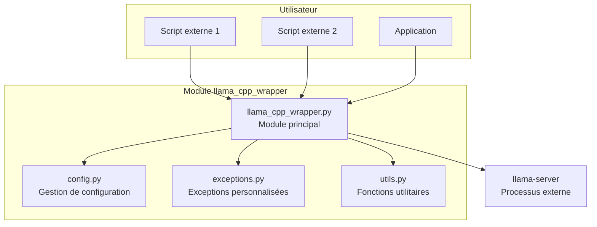

# Plan : Module Autonome llama.cpp

## Vue d'ensemble

Créer un module Python autonome et réutilisable qui encapsule llama.cpp pour remplacer Ollama dans des projets externes. Ce module doit être modulaire, robuste, facile à importer et à utiliser.

## Objectifs Principaux

1. **Encapsulation complète** de llama.cpp avec une interface Python propre
2. **Lancement automatique** du serveur llama.cpp avec des paramètres dynamiques
3. **API simple** pour envoyer des prompts et récupérer des réponses
4. **Gestion robuste des erreurs** et des ressources
5. **Documentation complète** avec exemples d'utilisation
6. **Isolation totale** du module pour une réutilisation facile

## Architecture du Module



## Structure du Répertoire

```
llama_cpp_wrapper/
├── __init__.py                 # Point d'entrée principal
├── core.py                     # Classe principale LlamaServer
├── config.py                   # Gestion de configuration
├── exceptions.py               # Exceptions personnalisées
├── utils.py                    # Fonctions utilitaires
├── models.py                   # Modèles Pydantic pour validation
└── examples/
    ├── basic_usage.py          # Exemple d'utilisation basique
    ├── advanced_usage.py       # Exemple d'utilisation avancée
    └── integration_example.py  # Exemple d'intégration avec DSPy/smolagents
```

## Composants du Module

### 1. `exceptions.py` - Exceptions Personnalisées

```python
"""
Exceptions personnalisées pour le module llama_cpp_wrapper.
"""

class LlamaCppError(Exception):
    """Exception de base pour toutes les erreurs llama.cpp."""
    pass

class ServerStartupError(LlamaCppError):
    """Erreur lors du démarrage du serveur llama-server."""
    pass

class ServerConnectionError(LlamaCppError):
    """Erreur lors de la connexion au serveur."""
    pass

class ModelNotFoundError(LlamaCppError):
    """Erreur : fichier modèle introuvable."""
    pass

class GenerationError(LlamaCppError):
    """Erreur lors de la génération de texte."""
    pass

class ConfigurationError(LlamaCppError):
    """Erreur de configuration invalide."""
    pass

class TimeoutError(LlamaCppError):
    """Erreur : timeout lors d'une opération."""
    pass
```

### 2. `models.py` - Modèles Pydantic

```python
"""
Modèles Pydantic pour la validation des configurations et réponses.
"""

from pydantic import BaseModel, Field, field_validator
from typing import Optional, List, Dict, Any
from pathlib import Path

class ServerConfig(BaseModel):
    """Configuration du serveur llama-server."""
    executable: str = Field(default="llama-server", description="Exécutable du serveur")
    host: str = Field(default="127.0.0.1", description="Adresse d'écoute")
    port: int = Field(default=8080, ge=1, le=65535, description="Port d'écoute")
    n_gpu_layers: int = Field(default=-1, ge=-1, description="Nombre de couches GPU (-1 pour toutes)")
    n_threads: int = Field(default=0, ge=-1, description="Nombre de threads CPU (0 pour auto)")
    ctx_size: int = Field(default=8192, gt=0, description="Taille du contexte")
    batch_size: int = Field(default=512, gt=0, description="Taille du batch")
    ubatch_size: int = Field(default=128, gt=0, description="Taille du micro-batch")
    cache_type_k: str = Field(default="f16", description="Type de cache K")
    cache_type_v: str = Field(default="f16", description="Type de cache V")
    
    @field_validator('executable')
    @classmethod
    def validate_executable(cls, v):
        """Valide que l'exécutable existe."""
        import shutil
        if not shutil.which(v):
            raise ValueError(f"Exécutable introuvable : {v}")
        return v

class ModelConfig(BaseModel):
    """Configuration du modèle LLM."""
    name: str = Field(..., description="Nom du modèle")
    path: str = Field(..., description="Chemin vers le fichier du modèle")
    api_base: Optional[str] = Field(None, description="URL de base de l'API (dérivée si None)")
    num_ctx: int = Field(default=8192, gt=0, description="Taille du contexte")
    
    @field_validator('path')
    @classmethod
    def path_exists(cls, v):
        """Vérifie que le fichier du modèle existe."""
        path = Path(v)
        if not path.exists():
            raise ValueError(f"Modèle introuvable : {v}")
        if not path.is_file():
            raise ValueError(f"Le chemin n'est pas un fichier : {v}")
        return v

class GenerationParams(BaseModel):
    """Paramètres de génération."""
    max_tokens: int = Field(default=512, ge=1, description="Nombre maximum de tokens")
    temperature: float = Field(default=0.7, ge=0.0, le=2.0, description="Température")
    top_p: float = Field(default=0.9, ge=0.0, le=1.0, description="Top-p sampling")
    top_k: int = Field(default=40, ge=0, description="Top-k sampling")
    repeat_penalty: float = Field(default=1.0, ge=0.0, description="Pénalité de répétition")
    presence_penalty: float = Field(default=0.0, ge=-2.0, le=2.0, description="Pénalité de présence")
    frequency_penalty: float = Field(default=0.0, ge=-2.0, le=2.0, description="Pénalité de fréquence")
    stop: Optional[List[str]] = Field(None, description="Séquences d'arrêt")

class Message(BaseModel):
    """Message de chat."""
    role: str = Field(..., description="Rôle : 'user', 'assistant', 'system'")
    content: str = Field(..., description="Contenu du message")

class GenerationResponse(BaseModel):
    """Réponse de génération."""
    content: str = Field(..., description="Texte généré")
    model: str = Field(..., description="Nom du modèle utilisé")
    tokens_used: int = Field(default=0, description="Nombre de tokens utilisés")
    finish_reason: Optional[str] = Field(None, description="Raison de fin")
```

### 3. `config.py` - Gestion de Configuration

```python
"""
Gestion de configuration pour le module llama_cpp_wrapper.
"""

from pathlib import Path
from typing import Optional, Dict, Any
import json
import yaml

from .models import ServerConfig, ModelConfig
from .exceptions import ConfigurationError

class ConfigManager:
    """Gestionnaire de configuration."""
    
    def __init__(self, config_path: Optional[Path] = None):
        """
        Initialise le gestionnaire de configuration.
        
        Args:
            config_path: Chemin vers le fichier de configuration (JSON ou YAML)
        """
        self.config_path = config_path
        self._server_config: Optional[ServerConfig] = None
        self._model_config: Optional[ModelConfig] = None
        
        if config_path and config_path.exists():
            self.load_from_file(config_path)
    
    def load_from_file(self, config_path: Path) -> None:
        """
        Charge la configuration depuis un fichier.
        
        Args:
            config_path: Chemin vers le fichier de configuration
            
        Raises:
            ConfigurationError: Si le fichier est invalide
        """
        try:
            with open(config_path, 'r', encoding='utf-8') as f:
                if config_path.suffix in ['.yml', '.yaml']:
                    data = yaml.safe_load(f)
                else:
                    data = json.load(f)
            
            self._server_config = ServerConfig(**data.get('server', {}))
            self._model_config = ModelConfig(**data.get('model', {}))
            
        except Exception as e:
            raise ConfigurationError(f"Erreur lors du chargement de la configuration : {e}")
    
    def load_from_dict(self, config_dict: Dict[str, Any]) -> None:
        """
        Charge la configuration depuis un dictionnaire.
        
        Args:
            config_dict: Dictionnaire de configuration
        """
        self._server_config = ServerConfig(**config_dict.get('server', {}))
        self._model_config = ModelConfig(**config_dict.get('model', {}))
    
    @property
    def server_config(self) -> ServerConfig:
        """Retourne la configuration du serveur."""
        if self._server_config is None:
            self._server_config = ServerConfig()
        return self._server_config
    
    @property
    def model_config(self) -> ModelConfig:
        """Retourne la configuration du modèle."""
        if self._model_config is None:
            raise ConfigurationError("Configuration du modèle non définie")
        return self._model_config
    
    def set_server_config(self, config: ServerConfig) -> None:
        """Définit la configuration du serveur."""
        self._server_config = config
    
    def set_model_config(self, config: ModelConfig) -> None:
        """Définit la configuration du modèle."""
        self._model_config = config
    
    def save_to_file(self, config_path: Path) -> None:
        """
        Sauvegarde la configuration dans un fichier.
        
        Args:
            config_path: Chemin vers le fichier de sauvegarde
        """
        data = {
            'server': self.server_config.model_dump(),
            'model': self.model_config.model_dump()
        }
        
        with open(config_path, 'w', encoding='utf-8') as f:
            if config_path.suffix in ['.yml', '.yaml']:
                yaml.dump(data, f, default_flow_style=False)
            else:
                json.dump(data, f, indent=2)
```

### 4. `utils.py` - Fonctions Utilitaires

```python
"""
Fonctions utilitaires pour le module llama_cpp_wrapper.
"""

import subprocess
import sys
import time
import requests
import socket
from pathlib import Path
from typing import Optional

from .exceptions import ServerConnectionError, TimeoutError

def check_port_available(port: int, host: str = "127.0.0.1") -> bool:
    """
    Vérifie si un port est disponible.
    
    Args:
        port: Numéro de port
        host: Adresse hôte
        
    Returns:
        True si le port est disponible, False sinon
    """
    with socket.socket(socket.AF_INET, socket.SOCK_STREAM) as s:
        try:
            s.bind((host, port))
            return True
        except OSError:
            return False

def wait_for_server(
    api_base: str,
    timeout: int = 60,
    check_interval: float = 1.0
) -> bool:
    """
    Attend que le serveur soit prêt.
    
    Args:
        api_base: URL de base de l'API
        timeout: Timeout en secondes
        check_interval: Intervalle entre les vérifications
        
    Returns:
        True si le serveur est prêt, False sinon
        
    Raises:
        TimeoutError: Si le timeout est dépassé
    """
    start_time = time.time()
    
    while time.time() - start_time < timeout:
        try:
            response = requests.get(f"{api_base}/health", timeout=2)
            if response.status_code == 200:
                return True
            elif response.status_code == 503:
                # Modèle en cours de chargement
                time.sleep(check_interval)
                continue
        except requests.RequestException:
            pass
        
        time.sleep(check_interval)
    
    raise TimeoutError(f"Le serveur n'est pas prêt après {timeout} secondes")

def kill_process_on_port(port: int, host: str = "127.0.0.1") -> bool:
    """
    Tue le processus utilisant un port spécifique.
    
    Args:
        port: Numéro de port
        host: Adresse hôte
        
    Returns:
        True si un processus a été tué, False sinon
    """
    try:
        if sys.platform == "win32":
            # Windows
            result = subprocess.run(
                ["netstat", "-ano"],
                capture_output=True,
                text=True
            )
            for line in result.stdout.split('\n'):
                if f"{host}:{port}" in line and "LISTENING" in line:
                    parts = line.split()
                    if len(parts) >= 5:
                        pid = parts[-1]
                        subprocess.run(["taskkill", "/F", "/PID", pid], capture_output=True)
                        return True
        else:
            # Linux/Mac
            result = subprocess.run(
                ["lsof", "-t", "-i", f":{port}"],
                capture_output=True,
                text=True
            )
            if result.stdout.strip():
                pid = result.stdout.strip()
                subprocess.run(["kill", "-9", pid], capture_output=True)
                return True
    except Exception:
        pass
    
    return False

def format_llama_command(
    executable: str,
    model_path: str,
    server_config: dict
) -> list:
    """
    Formate la commande llama-server de manière cohérente.
    
    Args:
        executable: Nom de l'exécutable
        model_path: Chemin vers le modèle
        server_config: Configuration du serveur
        
    Returns:
        Liste des arguments pour subprocess
    """
    # Ajouter l'extension .exe sur Windows si nécessaire
    if sys.platform == "win32" and not executable.endswith(".exe"):
        executable += ".exe"
    
    cmd = [
        executable,
        "-m", model_path,
        "--host", server_config.get("host", "127.0.0.1"),
        "--port", str(server_config.get("port", 8080)),
        "-ngl", str(server_config.get("n_gpu_layers", -1)),
        "-t", str(server_config.get("n_threads", 0)),
        "-c", str(server_config.get("ctx_size", 8192)),
        "-b", str(server_config.get("batch_size", 512)),
        "-ub", str(server_config.get("ubatch_size", 128)),
        "-ctk", server_config.get("cache_type_k", "f16"),
        "-ctv", server_config.get("cache_type_v", "f16"),
    ]
    
    return cmd

def validate_model_path(model_path: str) -> Path:
    """
    Valide et retourne le chemin du modèle.
    
    Args:
        model_path: Chemin vers le modèle
        
    Returns:
        Chemin validé
        
    Raises:
        ModelNotFoundError: Si le modèle n'existe pas
    """
    path = Path(model_path)
    if not path.exists():
        raise ModelNotFoundError(f"Modèle introuvable : {model_path}")
    if not path.is_file():
        raise ModelNotFoundError(f"Le chemin n'est pas un fichier : {model_path}")
    return path
```

### 5. `core.py` - Classe Principale LlamaServer

```python
"""
Classe principale pour la gestion de llama-server.
"""

import subprocess
import time
import requests
import atexit
import logging
from typing import Optional, List, Dict, Any, Union
from contextlib import contextmanager
from pathlib import Path

from .models import (
    ServerConfig, ModelConfig, GenerationParams, 
    Message, GenerationResponse
)
from .config import ConfigManager
from .exceptions import (
    ServerStartupError, ServerConnectionError, 
    ModelNotFoundError, GenerationError, TimeoutError
)
from .utils import (
    check_port_available, wait_for_server, kill_process_on_port,
    format_llama_command, validate_model_path
)

class LlamaServer:
    """
    Classe principale pour gérer llama-server.
    
    Cette classe encapsule toutes les fonctionnalités nécessaires pour
    démarrer, gérer et utiliser llama-server de manière transparente.
    """
    
    def __init__(
        self,
        model_path: Optional[str] = None,
        model_name: Optional[str] = None,
        server_config: Optional[ServerConfig] = None,
        model_config: Optional[ModelConfig] = None,
        config_path: Optional[Path] = None,
        auto_start: bool = True,
        auto_stop: bool = True
    ):
        """
        Initialise le gestionnaire llama-server.
        
        Args:
            model_path: Chemin vers le fichier modèle (prioritaire sur config)
            model_name: Nom du modèle (prioritaire sur config)
            server_config: Configuration du serveur
            model_config: Configuration du modèle
            config_path: Chemin vers un fichier de configuration
            auto_start: Démarrer automatiquement le serveur
            auto_stop: Arrêter automatiquement le serveur à la destruction
        """
        self._process: Optional[subprocess.Popen] = None
        self._auto_stop = auto_stop
        self._started = False
        
        # Configuration
        self._config_manager = ConfigManager(config_path)
        
        # Appliquer les configurations prioritaires
        if server_config:
            self._config_manager.set_server_config(server_config)
        if model_config:
            self._config_manager.set_model_config(model_config)
        
        # Appliquer les paramètres directs
        if model_path:
            self._config_manager.model_config.path = model_path
        if model_name:
            self._config_manager.model_config.name = model_name
        
        # Logger
        self._logger = logging.getLogger(__name__)
        
        # Démarrage automatique
        if auto_start:
            self.start()
    
    @property
    def server_config(self) -> ServerConfig:
        """Retourne la configuration du serveur."""
        return self._config_manager.server_config
    
    @property
    def model_config(self) -> ModelConfig:
        """Retourne la configuration du modèle."""
        return self._config_manager.model_config
    
    @property
    def api_base(self) -> str:
        """Retourne l'URL de base de l'API."""
        if self.model_config.api_base:
            return self.model_config.api_base
        return f"http://{self.server_config.host}:{self.server_config.port}"
    
    @property
    def is_running(self) -> bool:
        """Vérifie si le serveur est en cours d'exécution."""
        try:
            response = requests.get(f"{self.api_base}/health", timeout=2)
            return response.status_code == 200
        except Exception:
            return False
    
    def start(self, timeout: int = 60) -> bool:
        """
        Démarre le serveur llama-server.
        
        Args:
            timeout: Timeout en secondes
            
        Returns:
            True si le démarrage a réussi
            
        Raises:
            ServerStartupError: Si le démarrage échoue
            ModelNotFoundError: Si le modèle n'existe pas
        """
        if self.is_running:
            self._logger.info("✅ llama-server est déjà en cours d'exécution")
            self._started = True
            return True
        
        # Valider le modèle
        validate_model_path(self.model_config.path)
        
        # Vérifier le port
        if not check_port_available(self.server_config.port, self.server_config.host):
            self._logger.warning(
                f"⚠️ Port {self.server_config.port} déjà utilisé, "
                "tentative de libération..."
            )
            kill_process_on_port(self.server_config.port, self.server_config.host)
        
        # Construire la commande
        cmd = format_llama_command(
            self.server_config.executable,
            self.model_config.path,
            self.server_config.model_dump()
        )
        
        self._logger.info("🚀 Démarrage de llama-server...")
        self._logger.info(f"   Modèle: {self.model_config.path}")
        self._logger.info(f"   Port: {self.server_config.port}")
        self._logger.info(f"   GPU Layers: {self.server_config.n_gpu_layers}")
        self._logger.info(f"   API: {self.api_base}")
        
        try:
            # Démarrer le processus
            self._process = subprocess.Popen(
                cmd,
                stdout=subprocess.PIPE,
                stderr=subprocess.PIPE,
                creationflags=subprocess.CREATE_NO_WINDOW if sys.platform == "win32" else 0
            )
            
            # Attendre que le serveur soit prêt
            wait_for_server(self.api_base, timeout)
            
            self._logger.info(
                f"✅ llama-server démarré avec succès (PID: {self._process.pid})"
            )
            self._started = True
            
            # Enregistrer l'arrêt automatique si demandé
            if self._auto_stop:
                atexit.register(self.stop)
            
            return True
            
        except TimeoutError as e:
            self._cleanup_process()
            raise ServerStartupError(f"Timeout lors du démarrage : {e}")
        except Exception as e:
            self._cleanup_process()
            raise ServerStartupError(f"Erreur lors du démarrage : {e}")
    
    def stop(self, force: bool = False) -> bool:
        """
        Arrête le serveur llama-server.
        
        Args:
            force: Forcer l'arrêt (SIGKILL)
            
        Returns:
            True si l'arrêt a réussi
        """
        if self._process is None:
            return True
        
        try:
            self._logger.info(
                f"🛑 Arrêt de llama-server (PID: {self._process.pid})..."
            )
            
            if force:
                self._process.kill()
            else:
                self._process.terminate()
            
            try:
                self._process.wait(timeout=10)
            except subprocess.TimeoutExpired:
                self._logger.warning("⚠️ Timeout, envoi de SIGKILL...")
                self._process.kill()
                self._process.wait()
            
            self._logger.info("✅ llama-server arrêté proprement")
            return True
            
        except Exception as e:
            self._logger.error(f"❌ Erreur lors de l'arrêt : {e}")
            return False
        finally:
            self._cleanup_process()
    
    def _cleanup_process(self) -> None:
        """Nettoie le processus."""
        if self._process:
            try:
                self._process.stdout.close()
                self._process.stderr.close()
            except Exception:
                pass
            self._process = None
            self._started = False
    
    def restart(self, timeout: int = 60) -> bool:
        """
        Redémarre le serveur.
        
        Args:
            timeout: Timeout en secondes
            
        Returns:
            True si le redémarrage a réussi
        """
        self.stop()
        return self.start(timeout)
    
    def generate(
        self,
        prompt: str,
        params: Optional[GenerationParams] = None,
        timeout: int = 120
    ) -> GenerationResponse:
        """
        Génère du texte à partir d'un prompt.
        
        Args:
            prompt: Prompt de génération
            params: Paramètres de génération
            timeout: Timeout en secondes
            
        Returns:
            Réponse de génération
            
        Raises:
            ServerConnectionError: Si le serveur n'est pas accessible
            GenerationError: Si la génération échoue
        """
        if not self.is_running:
            raise ServerConnectionError("Le serveur n'est pas en cours d'exécution")
        
        params = params or GenerationParams()
        
        payload = {
            "model": self.model_config.name,
            "prompt": prompt,
            "max_tokens": params.max_tokens,
            "temperature": params.temperature,
            "top_p": params.top_p,
            "top_k": params.top_k,
            "repeat_penalty": params.repeat_penalty,
            "presence_penalty": params.presence_penalty,
            "frequency_penalty": params.frequency_penalty,
        }
        
        if params.stop:
            payload["stop"] = params.stop
        
        try:
            response = requests.post(
                f"{self.api_base}/v1/completions",
                json=payload,
                timeout=timeout
            )
            response.raise_for_status()
            
            data = response.json()
            
            return GenerationResponse(
                content=data["choices"][0]["text"],
                model=data["model"],
                tokens_used=data.get("usage", {}).get("total_tokens", 0),
                finish_reason=data["choices"][0].get("finish_reason")
            )
            
        except requests.RequestException as e:
            raise GenerationError(f"Erreur lors de la génération : {e}")
    
    def chat(
        self,
        messages: List[Message],
        params: Optional[GenerationParams] = None,
        timeout: int = 120
    ) -> GenerationResponse:
        """
        Génère une réponse de chat.
        
        Args:
            messages: Liste des messages
            params: Paramètres de génération
            timeout: Timeout en secondes
            
        Returns:
            Réponse de génération
            
        Raises:
            ServerConnectionError: Si le serveur n'est pas accessible
            GenerationError: Si la génération échoue
        """
        if not self.is_running:
            raise ServerConnectionError("Le serveur n'est pas en cours d'exécution")
        
        params = params or GenerationParams()
        
        payload = {
            "model": self.model_config.name,
            "messages": [m.model_dump() for m in messages],
            "max_tokens": params.max_tokens,
            "temperature": params.temperature,
            "top_p": params.top_p,
            "top_k": params.top_k,
            "repeat_penalty": params.repeat_penalty,
            "presence_penalty": params.presence_penalty,
            "frequency_penalty": params.frequency_penalty,
        }
        
        if params.stop:
            payload["stop"] = params.stop
        
        try:
            response = requests.post(
                f"{self.api_base}/v1/chat/completions",
                json=payload,
                timeout=timeout
            )
            response.raise_for_status()
            
            data = response.json()
            
            return GenerationResponse(
                content=data["choices"][0]["message"]["content"],
                model=data["model"],
                tokens_used=data.get("usage", {}).get("total_tokens", 0),
                finish_reason=data["choices"][0].get("finish_reason")
            )
            
        except requests.RequestException as e:
            raise GenerationError(f"Erreur lors de la génération : {e}")
    
    def __enter__(self):
        """Support du gestionnaire de contexte."""
        if not self._started:
            self.start()
        return self
    
    def __exit__(self, exc_type, exc_val, exc_tb):
        """Support du gestionnaire de contexte."""
        self.stop()
        return False
    
    def __del__(self):
        """Destructeur."""
        if self._auto_stop:
            self.stop()

# Fonctions utilitaires pour une utilisation simplifiée

def quick_generate(
    model_path: str,
    prompt: str,
    model_name: str = "llama-model",
    **kwargs
) -> str:
    """
    Fonction utilitaire pour une génération rapide.
    
    Args:
        model_path: Chemin vers le modèle
        prompt: Prompt de génération
        model_name: Nom du modèle
        **kwargs: Paramètres supplémentaires
        
    Returns:
        Texte généré
    """
    server = LlamaServer(
        model_path=model_path,
        model_name=model_name,
        auto_start=True,
        auto_stop=True
    )
    response = server.generate(prompt, **kwargs)
    return response.content

def quick_chat(
    model_path: str,
    messages: List[Union[Message, Dict[str, str]]],
    model_name: str = "llama-model",
    **kwargs
) -> str:
    """
    Fonction utilitaire pour un chat rapide.
    
    Args:
        model_path: Chemin vers le modèle
        messages: Liste des messages
        model_name: Nom du modèle
        **kwargs: Paramètres supplémentaires
        
    Returns:
        Réponse générée
    """
    # Convertir les dictionnaires en objets Message si nécessaire
    msg_objects = []
    for m in messages:
        if isinstance(m, dict):
            msg_objects.append(Message(**m))
        else:
            msg_objects.append(m)
    
    server = LlamaServer(
        model_path=model_path,
        model_name=model_name,
        auto_start=True,
        auto_stop=True
    )
    response = server.chat(msg_objects, **kwargs)
    return response.content
```

### 6. `__init__.py` - Point d'Entrée

```python
"""
Module llama_cpp_wrapper - Encapsulation autonome de llama.cpp.

Ce module fournit une interface Python simple et robuste pour utiliser
llama.cpp (llama-server) comme alternative à Ollama dans vos projets.

Usage basique:
    from llama_cpp_wrapper import LlamaServer, quick_generate
    
    # Avec la classe
    server = LlamaServer(model_path="path/to/model.gguf")
    response = server.generate("Hello, world!")
    print(response.content)
    server.stop()
    
    # Avec la fonction utilitaire
    result = quick_generate("path/to/model.gguf", "Hello, world!")
    print(result)
"""

from .core import LlamaServer, quick_generate, quick_chat
from .models import (
    ServerConfig, ModelConfig, GenerationParams, 
    Message, GenerationResponse
)
from .config import ConfigManager
from .exceptions import (
    LlamaCppError,
    ServerStartupError,
    ServerConnectionError,
    ModelNotFoundError,
    GenerationError,
    ConfigurationError,
    TimeoutError
)

__version__ = "1.0.0"
__all__ = [
    # Classes principales
    "LlamaServer",
    "ConfigManager",
    
    # Modèles
    "ServerConfig",
    "ModelConfig",
    "GenerationParams",
    "Message",
    "GenerationResponse",
    
    # Exceptions
    "LlamaCppError",
    "ServerStartupError",
    "ServerConnectionError",
    "ModelNotFoundError",
    "GenerationError",
    "ConfigurationError",
    "TimeoutError",
    
    # Fonctions utilitaires
    "quick_generate",
    "quick_chat",
]
```

## Exemples d'Utilisation

### Exemple 1 : Utilisation Basique

```python
"""
Exemple d'utilisation basique du module llama_cpp_wrapper.
"""

from llama_cpp_wrapper import LlamaServer, GenerationParams

# Créer et démarrer le serveur
server = LlamaServer(
    model_path="C:\\Modeles_LLM\\Qwen3.5-9B-Q4_K_S.gguf",
    model_name="qwen3.5-9b",
    auto_start=True,
    auto_stop=True
)

# Générer du texte
response = server.generate(
    "Expliquez en quelques phrases ce qu'est l'intelligence artificielle.",
    params=GenerationParams(
        max_tokens=200,
        temperature=0.7
    )
)

print(f"Réponse: {response.content}")
print(f"Tokens utilisés: {response.tokens_used}")
```

### Exemple 2 : Utilisation avec Gestionnaire de Contexte

```python
"""
Exemple d'utilisation avec gestionnaire de contexte.
"""

from llama_cpp_wrapper import LlamaServer, GenerationParams

with LlamaServer(
    model_path="C:\\Modeles_LLM\\Qwen3.5-9B-Q4_K_S.gguf",
    model_name="qwen3.5-9b"
) as server:
    # Le serveur démarre automatiquement
    
    response = server.generate(
        "Quels sont les avantages de llama.cpp par rapport à Ollama ?",
        params=GenerationParams(max_tokens=300, temperature=0.5)
    )
    
    print(response.content)
    
# Le serveur s'arrête automatiquement à la sortie du bloc with
```

### Exemple 3 : Utilisation avec Configuration JSON

```python
"""
Exemple d'utilisation avec fichier de configuration.
"""

from llama_cpp_wrapper import LlamaServer
from pathlib import Path

# Charger la configuration depuis un fichier
config_path = Path("llama_config.json")

with LlamaServer(config_path=config_path) as server:
    response = server.generate("Bonjour !")
    print(response.content)
```

### Exemple 4 : Chat avec Historique

```python
"""
Exemple de chat avec historique de messages.
"""

from llama_cpp_wrapper import LlamaServer, Message, GenerationParams

with LlamaServer(
    model_path="C:\\Modeles_LLM\\Qwen3.5-9B-Q4_K_S.gguf",
    model_name="qwen3.5-9b"
) as server:
    # Historique de conversation
    messages = [
        Message(role="system", content="Vous êtes un assistant utile."),
        Message(role="user", content="Quel est le sens de la vie ?"),
    ]
    
    # Premier échange
    response = server.chat(messages, GenerationParams(max_tokens=150))
    print(f"Assistant: {response.content}")
    
    # Ajouter la réponse à l'historique
    messages.append(Message(role="assistant", content=response.content))
    messages.append(Message(role="user", content="Peux-tu développer ?"))
    
    # Deuxième échange
    response = server.chat(messages, GenerationParams(max_tokens=150))
    print(f"Assistant: {response.content}")
```

### Exemple 5 : Intégration avec DSPy

```python
"""
Exemple d'intégration avec DSPy.
"""

import dspy
from llama_cpp_wrapper import LlamaServer, ServerConfig, ModelConfig

# Configurer le serveur
server = LlamaServer(
    model_path="C:\\Modeles_LLM\\Qwen3.5-9B-Q4_K_S.gguf",
    model_name="qwen3.5-9b",
    server_config=ServerConfig(port=8080),
    auto_start=True
)

# Configurer DSPy
lm = dspy.LM(
    model=f"openai/{server.model_config.name}",
    api_base=server.api_base,
    api_key="dummy",
    model_type="chat"
)
dspy.configure(lm=lm)

# Utiliser DSPy normalement
result = lm("Réponds par 'OK DSPy'.")
print(result)

# Arrêter le serveur
server.stop()
```

### Exemple 6 : Intégration avec smolagents

```python
"""
Exemple d'intégration avec smolagents.
"""

from smolagents import LiteLLMModel
from llama_cpp_wrapper import LlamaServer

# Configurer le serveur
server = LlamaServer(
    model_path="C:\\Modeles_LLM\\Qwen3.5-9B-Q4_K_S.gguf",
    model_name="qwen3.5-9b",
    auto_start=True
)

# Créer le modèle smolagents
model = LiteLLMModel(
    model_id=f"openai/{server.model_config.name}",
    api_base=server.api_base,
    api_key="dummy",
    num_ctx=8192,
)

# Utiliser le modèle
response = model("Réponds par 'OK smolagents'.")
print(response)

# Arrêter le serveur
server.stop()
```

### Exemple 7 : Utilisation des Fonctions Utilitaires

```python
"""
Exemple d'utilisation des fonctions utilitaires rapides.
"""

from llama_cpp_wrapper import quick_generate, quick_chat

# Génération rapide
result = quick_generate(
    model_path="C:\\Modeles_LLM\\Qwen3.5-9B-Q4_K_S.gguf",
    prompt="Dis-moi une blague courte.",
    model_name="qwen3.5-9b",
    max_tokens=100,
    temperature=0.8
)
print(result)

# Chat rapide
messages = [
    {"role": "user", "content": "Qui es-tu ?"}
]
response = quick_chat(
    model_path="C:\\Modeles_LLM\\Qwen3.5-9B-Q4_K_S.gguf",
    messages=messages,
    model_name="qwen3.5-9b",
    max_tokens=50
)
print(response)
```

## Format de Fichier de Configuration

### JSON (config.json)

```json
{
  "server": {
    "executable": "llama-server",
    "host": "127.0.0.1",
    "port": 8080,
    "n_gpu_layers": -1,
    "n_threads": 0,
    "ctx_size": 8192,
    "batch_size": 512,
    "ubatch_size": 128,
    "cache_type_k": "f16",
    "cache_type_v": "f16"
  },
  "model": {
    "name": "qwen3.5-9b",
    "path": "C:\\Modeles_LLM\\Qwen3.5-9B-Q4_K_S.gguf",
    "num_ctx": 8192
  }
}
```

### YAML (config.yaml)

```yaml
server:
  executable: llama-server
  host: 127.0.0.1
  port: 8080
  n_gpu_layers: -1
  n_threads: 0
  ctx_size: 8192
  batch_size: 512
  ubatch_size: 128
  cache_type_k: f16
  cache_type_v: f16

model:
  name: qwen3.5-9b
  path: C:\Modeles_LLM\Qwen3.5-9B-Q4_K_S.gguf
  num_ctx: 8192
```

## Gestion des Erreurs

```python
"""
Exemple de gestion des erreurs.
"""

from llama_cpp_wrapper import (
    LlamaServer,
    ServerStartupError,
    ServerConnectionError,
    ModelNotFoundError,
    GenerationError
)

try:
    server = LlamaServer(
        model_path="C:\\Modeles_LLM\\Qwen3.5-9B-Q4_K_S.gguf",
        model_name="qwen3.5-9b"
    )
    
    response = server.generate("Hello, world!")
    print(response.content)
    
except ModelNotFoundError as e:
    print(f"❌ Modèle introuvable : {e}")
    
except ServerStartupError as e:
    print(f"❌ Erreur de démarrage : {e}")
    
except ServerConnectionError as e:
    print(f"❌ Erreur de connexion : {e}")
    
except GenerationError as e:
    print(f"❌ Erreur de génération : {e}")
    
finally:
    server.stop()
```

## Dépendances

```toml
[project]
name = "llama-cpp-wrapper"
version = "1.0.0"
description = "Module autonome pour encapsuler llama.cpp"
requires-python = ">=3.8"
dependencies = [
    "requests>=2.31.0",
    "pydantic>=2.0.0",
    "pyyaml>=6.0.0",
]

[project.optional-dependencies]
dev = [
    "pytest>=7.0.0",
    "black>=23.0.0",
    "ruff>=0.1.0",
]
```

## Avantages du Module

1. **Interface simple** : API intuitive et facile à utiliser
2. **Robustesse** : Gestion complète des erreurs et des ressources
3. **Flexibilité** : Configuration via code ou fichier
4. **Compatibilité** : Fonctionne avec DSPy, smolagents, LiteLLM
5. **Gestionnaire de contexte** : Nettoyage automatique des ressources
6. **Fonctions utilitaires** : Pour une utilisation rapide
7. **Documentation complète** : Exemples et guides d'utilisation
8. **Isolation** : Module autonome, facile à intégrer

## Prochaines Étapes

1. Créer la structure du répertoire
2. Implémenter tous les fichiers du module
3. Créer les exemples d'utilisation
4. Écrire les tests unitaires
5. Créer la documentation complète (README.md)
6. Tester l'intégration avec DSPy et smolagents
7. Créer un script d'installation
