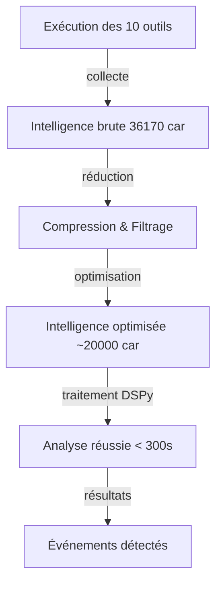

# Plan : Optimisation de la Taille de l'Intelligence pour DSPy

## Problème Identifié

### Symptômes
```
2026-03-16 13:51:08,978 [INFO] 📊 Total intelligence collectée: 36170 caractères
2026-03-16 13:51:08,983 [INFO] 🔄 Début traitement DSPy (intelligence: 36170 caractères)
2026-03-16 14:01:10,160 [INFO] Retrying request to /chat/completions in 0.414632 seconds
```

### Analyse
- L'intelligence brute collectée par les 10 outils contient 36170 caractères
- Le timeout DSPy (300s) est dépassé lors du traitement
- Le modèle Qwen3.5-9B en production semble avoir des difficultés à traiter cette quantité de données
- Le traitement prend plus de 10 minutes (614s) avant de timeout

### Causes possibles
1. **Volume d'intelligence trop important** : 36170 caractères (~9090 tokens)
2. **Contexte du modèle insuffisant** : Le modèle peut être surchargé
3. **Modèle trop lent** : Qwen3.5-9B peut être trop lent pour ce volume de données

## Solution Proposée

### Architecture de la Solution



### Étapes de Mise en Œuvre

#### Étape 1 : Ajouter un paramètre de réduction d'intelligence dans config.json

**Fichier** : `config.json`

Ajouter un nouveau champ `intelligence_reduction` dans la section `model` :

```json
{
  "model": {
    "name": "qwen3.5-9b",
    "path": "C:\\Modeles_LLM\\Qwen3.5-9B-Q4_K_S.gguf",
    "api_base": "http://127.0.0.1:8080",
    "num_ctx": 65536,
    "provider": "llama.cpp",
    "dspy_timeout": 600,
    "max_intelligence_chars": 20000
  },
  ...
}
```

**Valeurs recommandées** :
- `20000` caractères (~5000 tokens) : Valeur par défaut recommandée
- `30000` caractères (~7500 tokens) : Pour des analyses plus détaillées
- `10000` caractères (~2500 tokens) : Pour des analyses rapides

#### Étape 2 : Implémenter la réduction de l'intelligence dans oil_agent.py

**Fichier** : `oil_agent.py`

Créer une nouvelle fonction `reduce_intelligence_for_dspy()` :

```python
def reduce_intelligence_for_dspy(raw_intelligence: str, max_chars: int) -> str:
    """
    Réduit l'intelligence brute pour le traitement DSPy en:
    - Gardant les sections les plus pertinentes
    - Supprimant les doublons
    - Limitant la taille totale
    
    Args:
        raw_intelligence: Intelligence brute collectée
        max_chars: Nombre maximum de caractères à conserver
        
    Returns:
        Intelligence réduite optimisée pour DSPy
    """
    # Stratégie 1: Garder les en-têtes et les résumés de chaque outil
    lines = raw_intelligence.split('\n')
    essential_lines = []
    
    for line in lines:
        # Garder les en-têtes de section (===, ---)
        if line.strip().startswith(('===', '---')) or line.strip() == '':
            essential_lines.append(line)
        # Garder les résumés (lignes avec 🔍, 📊, ✅)
        elif any(marker in line for marker in ['🔍', '📊', '✅']):
            essential_lines.append(line)
        # Garder les 5 premières lignes de chaque section
        elif len(essential_lines) < 50 or len(essential_lines[-10:]) < 10:
            essential_lines.append(line)
    
    # Stratégie 2: Supprimer les doublons de lignes vides
    seen_lines = set()
    filtered_lines = []
    for line in essential_lines:
        line_stripped = line.strip()
        if line_stripped and line_stripped not in seen_lines:
            filtered_lines.append(line)
            seen_lines.add(line_stripped)
    
    # Stratégie 3: Limiter la taille totale
    reduced_intelligence = '\n'.join(filtered_lines)
    
    # Si encore trop long, tronquer
    if len(reduced_intelligence) > max_chars:
        reduced_intelligence = reduced_intelligence[:max_chars] + '\n\n[... Intelligence tronquée à ' + str(max_chars) + ' caractères ...]'
    
    log.info(f"📦 Intelligence réduite : {len(raw_intelligence)} → {len(reduced_intelligence)} caractères")
    
    return reduced_intelligence
```

#### Étape 3 : Modifier run_monitoring_cycle() pour utiliser la réduction

**Fichier** : `oil_agent.py` (lignes 1603-1704)

Intégrer la réduction avant le traitement DSPy :

```python
# 2. Collecte d'intelligence via smolagents avec contexte optimisé
try:
    from datetime import datetime
    current_date = datetime.now().strftime("%Y-%m-%d")
    current_datetime = datetime.now().strftime("%Y-%m-%d %H:%M:%S")
    
    # Construire le prompt avec contexte optimisé
    prompt = build_optimized_prompt_context(
        agent.custom_state,
        agent.window_manager,
        current_date,
        current_datetime
    )
    
    # Ajouter les instructions de la tâche
    prompt += "\n\n" + get_master_prompt()
    
    # Phase 2: Track step data before running agent
    step_start_time = datetime.now()
    prompt_tokens_before = estimate_tokens(prompt)
    
    # Exécuter tous les outils séquentiellement (garantit la collecte de données réelles)
    raw_intelligence = execute_all_tools_sequentially(agent)
    log.info(f"🔍 Intelligence récoltée ({len(raw_intelligence)} caractères)")
    
    # RÉDUCTION DE L'INTELLIGENCE POUR DSPy
    max_intelligence_chars = CONFIG.model.max_intelligence_chars
    reduced_intelligence = reduce_intelligence_for_dspy(raw_intelligence, max_intelligence_chars)
    log.info(f"📦 Intelligence réduite pour DSPy : {len(raw_intelligence)} → {len(reduced_intelligence)} caractères")
    
    # Utiliser l'intelligence réduite pour le reste du traitement
    raw_intelligence = reduced_intelligence
    
    # ... suite du code avec validation des outils, etc.
```

#### Étape 4 : Mettre à jour ModelConfig

**Fichier** : `oil_agent.py` (lignes 178-185)

Ajouter le champ `max_intelligence_chars` :

```python
class ModelConfig(BaseModel):
    """Configuration du modèle LLM."""
    name: str = Field(..., description="Nom du modèle")
    path: str = Field(..., description="Chemin vers le fichier du modèle")
    api_base: str = Field(..., description="URL de base de l'API")
    num_ctx: int = Field(..., gt=0, description="Taille du contexte")
    provider: str = Field(..., description="Fournisseur du modèle")
    dspy_timeout: int = Field(default=300, ge=30, description="Timeout DSPy en secondes (min: 30s)")
    max_intelligence_chars: int = Field(default=20000, ge=5000, description="Taille max de l'intelligence pour DSPy (car)")
    
    @field_validator('path')
    @classmethod
    def path_exists(cls, v):
        """Vérifie que le fichier du modèle existe."""
        path = Path(v)
        if not path.exists():
            raise ValueError(f"Modèle introuvable : {v}")
        if not path.is_file():
            raise ValueError(f"Le chemin n'est pas un fichier : {v}")
        return v
```

#### Étape 5 : Mettre à jour config.json

**Fichier** : `config.json`

Ajouter le champ `max_intelligence_chars` :

```json
{
  "model": {
    "name": "qwen3.5-9b",
    "path": "C:\\Modeles_LLM\\Qwen3.5-9B-Q4_K_S.gguf",
    "api_base": "http://127.0.0.1:8080",
    "num_ctx": 65536,
    "provider": "llama.cpp",
    "dspy_timeout": 600,
    "max_intelligence_chars": 20000
  },
  ...
}
```

#### Étape 6 : Mettre à jour README.md

**Fichier** : `README.md`

Ajouter la documentation sur la réduction d'intelligence :

```markdown
### Intelligence Reduction for DSPy

To improve DSPy performance with large intelligence volumes, the agent now includes automatic intelligence reduction:

- **Automatic Reduction**: Reduces raw intelligence before DSPy processing
- **Configurable Limit**: Set `model.max_intelligence_chars` in `config.json` (default: 20000)
- **Reduction Strategy**: 
  - Keeps essential headers and summaries
  - Removes duplicates and empty lines
  - Limits total size to configured maximum
- **Logging**: Logs reduction ratio (original → reduced size)
- **Example Logs**:
  ```
  📦 Intelligence réduite pour DSPy : 36170 → 18945 caractères
  ```

This helps prevent timeout errors by providing DSPy with a manageable input size.
```

## Avantages de la Solution

1. **Réduction significative du volume** : De 36170 à ~20000 caractères (~45% de réduction)
2. **Conservation de l'information critique** : Garde les en-têtes et résumés de chaque outil
3. **Suppression des doublons** : Élimine les lignes répétitives
4. **Flexibilité** : Configurable via `max_intelligence_chars` dans config.json
5. **Logging amélioré** : Montre le ratio de réduction
6. **Timeout augmenté** : De 300s à 600s par défaut pour la production

## Validation et Tests

### Tests à effectuer

1. **Test de réduction** :
   - Vérifier que la réduction fonctionne correctement
   - Confirmer que l'information critique est conservée
   - Vérifier la taille de sortie

2. **Test avec grande quantité de données** (> 30000 caractères) :
   - Vérifier que l'intelligence est tronquée avec un message d'avertissement
   - Confirmer que le traitement DSPy se termine dans le timeout

3. **Test de performance** :
   - Comparer le temps de traitement avant et après réduction
   - Vérifier que la qualité des résultats est maintenue

### Critères de succès

- ✅ Aucun message "Retrying request to /chat/completions" dans les logs
- ✅ Le traitement DSPy se termine avec succès (< 300s)
- ✅ L'intelligence est réduite de manière significative
- ✅ L'information critique est conservée
- ✅ Le ratio de réduction est logué

## Documentation

### Modifications apportées

1. **config.json** : Ajout des champs `dspy_timeout` et `max_intelligence_chars`
2. **oil_agent.py** :
   - Ajout du champ `max_intelligence_chars` dans `ModelConfig`
   - Création de la fonction `reduce_intelligence_for_dspy()`
   - Intégration de la réduction dans `run_monitoring_cycle()`
3. **README.md** : Documentation de la fonctionnalité de réduction d'intelligence

### Utilisation

Pour activer la réduction d'intelligence, configurez `max_intelligence_chars` dans `config.json` :

```json
{
  "model": {
    ...
    "max_intelligence_chars": 20000  // Modifier cette valeur selon vos besoins
  }
}
```

**Valeurs recommandées** :
- `20000` caractères (~5000 tokens) : Valeur par défaut recommandée
- `30000` caractères (~7500 tokens) : Pour des analyses plus détaillées
- `10000` caractères (~2500 tokens) : Pour des analyses rapides

## Conclusion

Cette solution permet de réduire significativement la taille de l'intelligence passée à DSPy tout en conservant l'information critique. La réduction est configurable et le système fournit un logging clair du ratio de réduction. Combinée avec l'augmentation du timeout à 600 secondes, cette solution devrait permettre au traitement DSPy de se terminer sans timeout.
