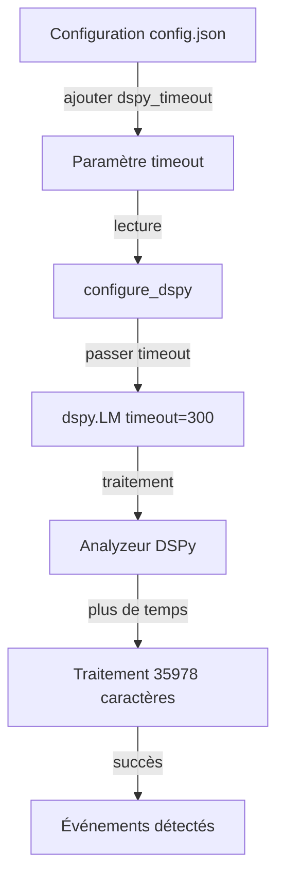

# Plan : Augmentation du Timeout DSPy pour le Traitement de l'Intelligence

## Problème Identifié

### Symptômes
```
2026-03-16 11:15:34,414 [INFO] 📈 Step 1/10 completed
2026-03-16 11:25:35,478 [INFO] Retrying request to /chat/completions in 0.490379 seconds
2026-03-16 11:35:35,989 [INFO] Retrying request to /chat/completions in 0.797511 seconds
2026-03-16 11:45:36,800 [INFO] Retrying request to /chat/completions in 1.584350 seconds
```

### Analyse
- Tous les outils de recherche ont été exécutés avec succès (10 outils)
- Intelligence collectée : 35978 caractères
- L'appel DSPy qui traite cette intelligence prend du temps
- Des retries sont générés pour `/chat/completions` avec des délais croissants
- Le timeout par défaut de DSPy est probablement trop court pour traiter cette quantité de données

### Localisation du Problème
- **Fichier** : `oil_agent.py`
- **Fonction concernée** : `configure_dspy()` (lignes 160-169)
- **Appel problématique** : `dspy.LM()` sans paramètre de timeout explicite
- **Traitement concerné** : Analyse DSPy dans `run_monitoring_cycle()` (lignes 1695-1701)

## Solution Proposée

### Architecture de la Solution



### Étapes de Mise en Œuvre

#### Étape 1 : Ajouter le paramètre de timeout dans config.json

**Fichier** : `config.json`

Ajouter un nouveau champ `dspy_timeout` dans la section `model` :

```json
{
  "model": {
    "name": "qwen3.5-9b",
    "path": "C:\\Modeles_LLM\\Qwen3.5-9B-Q4_K_S.gguf",
    "api_base": "http://127.0.0.1:8080",
    "num_ctx": 65536,
    "provider": "llama.cpp",
    "dspy_timeout": 300
  },
  ...
}
```

**Valeurs recommandées** :
- `300` secondes (5 minutes) : Valeur par défaut recommandée
- `600` secondes (10 minutes) : Pour de très gros volumes de données
- `120` secondes (2 minutes) : Pour des tests rapides

#### Étape 2 : Mettre à jour le modèle Pydantic ModelConfig

**Fichier** : `oil_agent.py` (lignes 176-193)

Ajouter le champ `dspy_timeout` :

```python
class ModelConfig(BaseModel):
    """Configuration du modèle LLM."""
    name: str = Field(..., description="Nom du modèle")
    path: str = Field(..., description="Chemin vers le fichier du modèle")
    api_base: str = Field(..., description="URL de base de l'API")
    num_ctx: int = Field(..., gt=0, description="Taille du contexte")
    provider: str = Field(..., description="Fournisseur du modèle")
    dspy_timeout: int = Field(default=300, ge=30, description="Timeout DSPy en secondes (min: 30s)")
    
    @field_validator('path')
    @classmethod
    def path_exists(cls, v):
        """Vérifie que le fichier du modèle existe."""
        path = Path(v)
        if not path.exists():
            raise ValueError(f"Modèle introuvable : {v}")
        if not path.is_file():
            raise ValueError(f"Le chemin n'est pas un fichier : {v}")
        return v
```

#### Étape 3 : Modifier la fonction configure_dspy()

**Fichier** : `oil_agent.py` (lignes 160-172)

Passer le paramètre `timeout` via `litellm_params` à `dspy.LM()` :

```python
def configure_dspy():
    """Configure DSPy avec le modèle llama-server défini dans CONFIG."""
    lm = dspy.LM(
        model=f"openai/{CONFIG.model.name}",
        api_base=CONFIG.model.api_base,
        api_key="dummy",  # llama-server ne nécessite pas de clé API
        model_type="chat",
        litellm_params={"timeout": CONFIG.model.dspy_timeout}  # Timeout configurable via litellm_params
    )
    dspy.configure(lm=lm, adapter=dspy.JSONAdapter())
    log.info(f"⚙️  DSPy configuré avec timeout: {CONFIG.model.dspy_timeout}s")
    return lm
```

**Note importante** : Le timeout doit être passé via `litellm_params` et non directement comme paramètre de `dspy.LM()`, car DSPy utilise LiteLLM en interne.

#### Étape 4 : Ajouter du logging pour le timeout

Ajouter un message de log dans `configure_dspy()` pour confirmer la configuration :

```python
def configure_dspy():
    """Configure DSPy avec le modèle llama-server défini dans CONFIG."""
    lm = dspy.LM(
        model=f"openai/{CONFIG.model.name}",
        api_base=CONFIG.model.api_base,
        api_key="dummy",  # llama-server ne nécessite pas de clé API
        model_type="chat",
        timeout=CONFIG.model.dspy_timeout  # Timeout configurable
    )
    dspy.configure(lm=lm, adapter=dspy.JSONAdapter())
    log.info(f"⚙️  DSPy configuré avec timeout: {CONFIG.model.dspy_timeout}s")
    return lm
```

#### Étape 5 : Ajouter un monitoring du temps de traitement DSPy

Dans `run_monitoring_cycle()` (lignes 1681-1752), ajouter un monitoring du temps de traitement :

```python
# 3. Synthèse et formatage via DSPy
events = []
try:
    analyzer = OilEventAnalyzer()
    
    # Charger les poids optimisés si disponibles
    optimized_path = Path(CONFIG.persistence.dataset_file).parent / "oil_analyzer_optimized.json"
    if optimized_path.exists():
        log.info(f"📂 Chargement du module DSPy optimisé : {optimized_path}")
        analyzer.load(str(optimized_path))
    
    current_date = datetime.now().strftime("%Y-%m-%d")
    current_datetime = datetime.now().strftime("%Y-%m-%d %H:%M:%S")
    
    # Monitoring du temps de traitement DSPy
    dspy_start = datetime.now()
    log.info(f"🔄 Début traitement DSPy (intelligence: {len(raw_intelligence)} caractères)")
    
    dspy_result = analyzer(
        current_date=current_date,
        current_datetime=current_datetime,
        alert_threshold=CONFIG.monitoring.alert_threshold,
        news_sources=CONFIG.monitoring.news_sources,
        raw_intelligence=raw_intelligence
    )
    
    dspy_duration = (datetime.now() - dspy_start).total_seconds()
    log.info(f"✅ Traitement DSPy terminé en {dspy_duration:.2f}s")
    
    # Avertissement si proche du timeout
    if dspy_duration > CONFIG.model.dspy_timeout * 0.8:
        log.warning(f"⚠️  Traitement DSPy proche du timeout ({dspy_duration:.2f}s / {CONFIG.model.dspy_timeout}s)")
```

## Validation et Tests

### Tests à effectuer

1. **Test avec petite quantité de données** (< 5000 caractères)
   - Vérifier que le traitement se termine rapidement
   - Confirmer que le timeout n'est pas atteint

2. **Test avec quantité moyenne de données** (10000-20000 caractères)
   - Vérifier le temps de traitement typique
   - Confirmer que le timeout est suffisant

3. **Test avec grande quantité de données** (> 30000 caractères)
   - Vérifier que le traitement se termine dans le timeout
   - Confirmer qu'il n'y a plus de retries

4. **Test de timeout**
   - Régler temporairement `dspy_timeout` à une valeur basse (ex: 30s)
   - Vérifier que le timeout est bien respecté
   - Restaurer la valeur normale

### Critères de succès

- ✅ Aucun message "Retrying request to /chat/completions" dans les logs
- ✅ Le traitement DSPy se termine avec succès pour 35978 caractères
- ✅ Le temps de traitement est logué et visible
- ✅ Le timeout est configurable via config.json
- ✅ Le timeout par défaut (300s) est suffisant pour les cas normaux

## Documentation

### Modifications apportées

1. **config.json** : Ajout du champ `dspy_timeout` dans la section `model`
2. **oil_agent.py** :
   - Mise à jour de `ModelConfig` avec le champ `dspy_timeout`
   - Modification de `configure_dspy()` pour utiliser le timeout configuré via `litellm_params`
   - Ajout de logging pour confirmer la configuration
   - Ajout de monitoring du temps de traitement DSPy

### Utilisation

Pour modifier le timeout DSPy, éditez `config.json` :

```json
{
  "model": {
    ...
    "dspy_timeout": 300  // Modifier cette valeur (en secondes)
  }
}
```

### Recommandations

- **Développement/Test** : `dspy_timeout: 120` (2 minutes)
- **Production normal** : `dspy_timeout: 300` (5 minutes)
- **Production avec gros volumes** : `dspy_timeout: 600` (10 minutes)

## Risques et Mitigations

### Risques identifiés

1. **Timeout trop long** : Le script peut sembler bloqué
   - **Mitigation** : Ajouter un monitoring du temps de traitement avec logs réguliers

2. **Timeout trop court** : Le traitement peut échouer
   - **Mitigation** : Valeur par défaut conservatrice (300s), avertissement si proche du timeout

3. **Incompatibilité DSPy** : Le paramètre `timeout` direct dans `dspy.LM()` n'est pas supporté
    - **Mitigation** : Utiliser `litellm_params={"timeout": ...}` pour passer le timeout à LiteLLM
    - **Note** : DSPy utilise LiteLLM en interne, donc le timeout doit être configuré via `litellm_params`

### Plan de rollback

En cas de problème, restaurer les fichiers originaux :
- `config.json` : Supprimer le champ `dspy_timeout`
- `oil_agent.py` : Restaurer la version originale de `configure_dspy()`

## Conclusion

Cette solution permet de configurer un timeout adapté au traitement de grandes quantités d'intelligence par DSPy, évitant ainsi les retries et les échecs de traitement. Le timeout est configurable via `config.json` et le système fournit un monitoring du temps de traitement pour ajuster la configuration si nécessaire.
